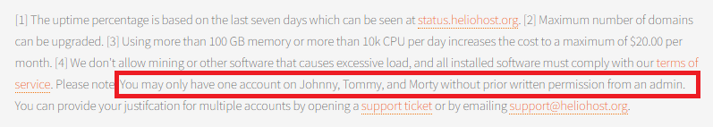

# Suspension Policy

There are a number of reasons why we might suspend you. To keep your account active, and avoid suspension, make sure you follow our simple requirements.

## Terms of Service

At HelioHost, before users can create an account, they must confirm they agree to follow the [Terms of Service](../hosting/terms.md). 

If you break the [Terms of Service](../hosting/terms.md), then you will be permanently suspended.

## High Server Usage

To ensure that every site on HelioHost is not slowed down by just one site hogging the server resources, we enforce a High Server Usage policy on all websites, which ensures that no website increases the server load on a massive scale. 

### Account Load Limits

On Johnny and Tommy, we enforce a memory limit of no more than 100 GB per day and a limit of 10,000 CPU usage per day. If you exceed those amounts you will get suspended. You can monitor your account load numbers on [the load page within your dashboard](https://heliohost.org/dashboard/load/).

### Understanding Memory and CPU

Memory is short-term computer storage, often called RAM (random access memory).

CPU is the brain of a computer that processes instructions and performs calculations, also known as the Central Processing Unit.

### How Account Load is Calculated

On [the load page within your dashboard](https://heliohost.org/dashboard/load/), account load totals are calculated by taking a sample once every 60 seconds. So, for instance, if you use 1 MB of memory constantly for the full 24 hours your total would be 1.4 GB at the end of the day. The CPU unit is 1% of the total speed of a CPU core, so if you used 1% of the core constantly for the entire day your total would be 1440 at the end of the day. 

If you have any questions, or need help reducing your account load, don't hesitate to open a support ticket on the [Customer Service forum](https://helionet.org/index/forum/45-customer-service/?do=add).

### Cron Jobs / Scheduled Tasks

In Plesk, cron jobs are called [Scheduled Tasks](../tutorials/plesk/cron-jobs.md). There is no limit on the number of cron jobs you can run, but they count towards your total account load. This means that running too many cron jobs or having one cron job run too frequently can increase your risk of getting suspended under the [High Server Usage](/accounts/suspension-policy.md#high-server-usage) policy. For example, sometimes people start a cron job to run every 1 minute and then get suspended for high load pretty quickly because of it. You can monitor your account load numbers on [the load page within your dashboard](https://heliohost.org/dashboard/load/).

## Duplicate Accounts

Each person/user is only allowed one account on HelioHost. Even if you use different email addresses. The limit is 1 account per human being. 

### Signup page mentions 1 account per person

Below the server choices on the signup page, users are shown a warning that says, **"You may only have one account"**: 

### Terms of Service page mentions 1 account per person

The first item of the [Terms of Service](../hosting/terms.md), which all users must agree to before creating an account, says, **"Each person is allowed to have one account"**:

If you require more than one website, then many features of another HelioHost account are already possible with your current account. Read up on [Parked, Addon and Sub Domains](../management/parked-addon-and-sub-domains.md) for more information on how to make multiple websites on one account.

If you are caught with two or more accounts, you will be asked which one(s) you would like to be deleted, and if you do not reply we will permanently suspend all of them.

### Managing Accounts on Behalf of Others

Managing someone else's account on their behalf is considered the same as having 2 accounts and will subject you to suspension unless approved ahead of time by an admin.

## Inactivity Policy

To ensure that old, unused HelioHost accounts are not filling up our server with useless data, we have an inactivity policy in place which will suspend you if you do not log in to [heliohost.org](https://heliohost.org/) or [heliohost.org/login](https://heliohost.org/login/) at least once every 30 days. Each time you log in, your last login date is set to the current time, so your account will then remain active for another 30 days.

If your account is to be suspended due to inactivity, you will receive an email warning you that you must log in soon at 28 days. You will also receive another email when your website is taken offline at 30 days.

To activate a suspended account which was suspended due to inactivity, go to [heliohost.org/renew](http://heliohost.org/renew/)

If you receive an inactivity email even though you have logged into Plesk recently, then you might be logged into Plesk using a faulty URL. To ensure that your logins are logged, log in at [heliohost.org](https://heliohost.org/) or [heliohost.org/login](https://heliohost.org/login/) at least once a month.

## Further Information

If you have been suspended for something and you're not sure why or what for, or the renew script doesn't work, please don't hesitate to post in the [Customer Service forum](https://helionet.org/index/forum/45-customer-service/), making sure to provide your **username**, **domain name**, and **server name** up front so we can provide you with the best and most efficient support.