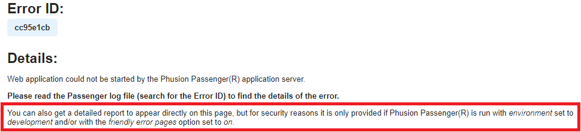
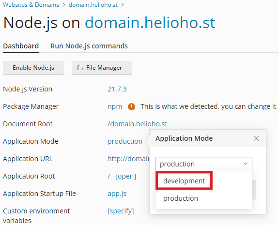
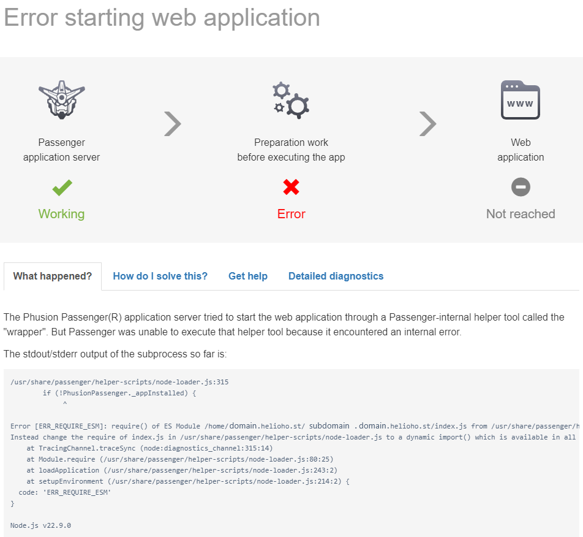


If you use Node.js, we strongly recommend that you [monitor your site load here](https://heliohost.org/dashboard/load/).

Node apps often require a lot of server resources, and exceeding the account load limits will cause your user account to be [suspended for high server usage](../accounts/suspension-policy.md#high-server-usage).


## Could not spawn process for application /[your app path]: The application process exited prematurely.

When running a Node app using Passenger, if you receive an error message that says:

`Could not spawn process for application /[your app path]: The application process exited prematurely.
  Error ID: ########
  Error details saved to: /tmp/passenger-error-######.html`

This is caused by using import statements of `require()`.

## How to Fix the Error

To resolve the error, change your `require()` statements to `import()`, as explained in [the answer on this discussion](https://github.com/orgs/adonisjs/discussions/4364).

## Troubleshooting Node / Passenger Issues

More detailed error reporting is available by setting the Passenger environment to `Development`.

To change your environment to `Development` mode, navigate to:

#### Login > Plesk > Websites & Domains > [domain] > Node.js 

In the `Development` environment, you will see the full error message:

`Error [ERR_REQUIRE_ESM]: require() of ES Module /home/domain.helioho.st/subdomain.domain.helioho.st/index.js from /usr/share/passenger/helper-scripts/node-loader.js not supported.
Instead change the require of index.js in /usr/share/passenger/helper-scripts/node-loader.js to a dynamic import() which is available in all CommonJS modules.
    at TracingChannel.traceSync (node:diagnostics_channel:315:14)
    at Module.require (/usr/share/passenger/helper-scripts/node-loader.js:80:25)
    at loadApplication (/usr/share/passenger/helper-scripts/node-loader.js:243:2)
    at setupEnvironment (/usr/share/passenger/helper-scripts/node-loader.js:214:2)
  code: 'ERR_REQUIRE_ESM'`

## Further Support 

If after changing your imports to `require()` it still isn't working, please go back and check all of your steps again. If it still isn't working after you have changed all your import statements and [cleared your web browser cache](../misc/clear-your-cache.md), please make a new post in the [Customer Service forum](https://helionet.org/index/forum/45-customer-service/?do=add), making sure to provide your **username**, **domain name**, and details about the problem, including any **error message(s)** received.