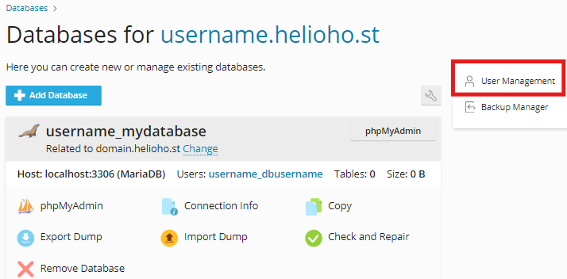

# phpMyAdmin / MariaDB Access Denied Error

When trying to login to phpMyAdmin to access MariaDB, if you get an error message that says: 

`Access denied for user 'yourusername_admin'@'localhost' (using password: YES)`

Please follow the steps below to resolve the issue:

1) Login at [heliohost.org/login](https://heliohost.org/login/)
2) Continue to Plesk
3) Click on `Databases`
4) Click on `User Management` (see the screenshot below)
5) Click on the username mentioned in the phpMyAdmin error message
6) Copy/paste a strong password into the password fields
7) Click on the `OK` button to save the changes


Keep in mind if you change your password or your database user, you will need to update the config files of any applicable software.

For instance, if you're using WordPress (which [we don't recommend](../misc/wordpress.md)), you'll need to make sure that the database password in the `wp-config.php` file matches the password you enter into Plesk.


## Further Support

If you’re still having trouble after double-checking you followed all the steps above, please post a topic in the [Customer Support forum](https://helionet.org/index/forum/45-customer-service/?do=add). Be sure to include your **hosting account username**, **domain name**, **database name**, **database user name**, details of the problem, troubleshooting steps you have tried, and any **error message(s)** received.