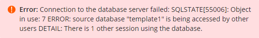

# PostgreSQL Database Creation Error

If when creating a database, you get an error like the following:

`Error: Connection to the database server failed: SQLSTATE[55006]: Object in use: 7 ERROR: source database "template1" is being accessed by other users DETAIL: There is 1 other session using the database.`

This means the server in the process of creating another database for someone else.

In most cases, the fix is to try again later.

## Further Support 

If you've already waited and tried again later and the problem still exists, or if you get a different error, please make a new post in the [Customer Service forum](https://helionet.org/index/forum/45-customer-service/?do=add), making sure to provide your **username**, **domain name**, and details about the problem, including any **error message(s)** received.