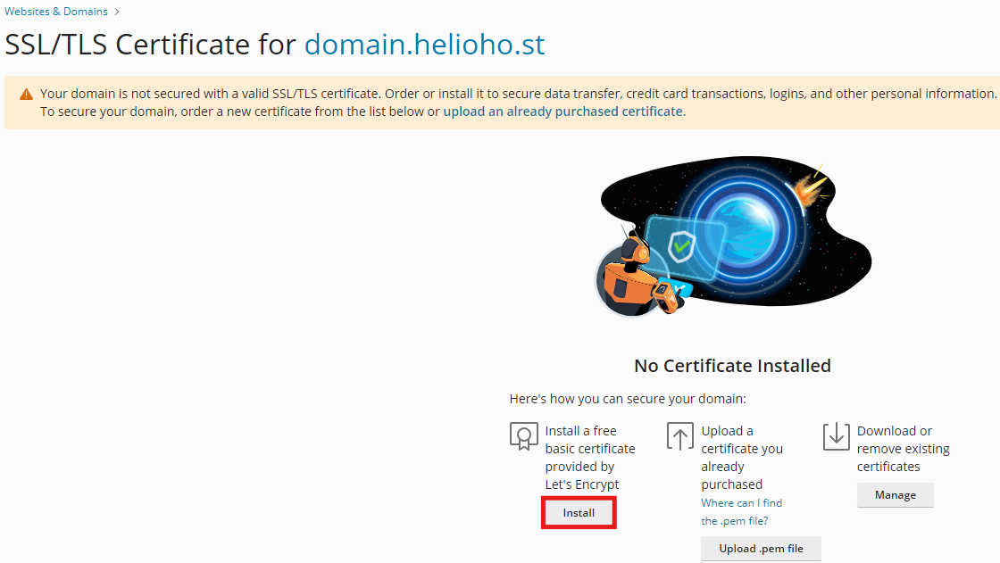
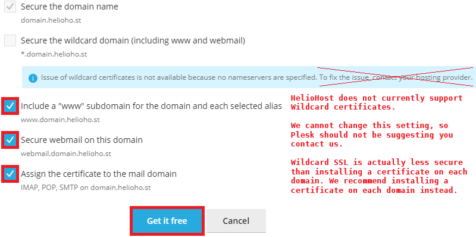
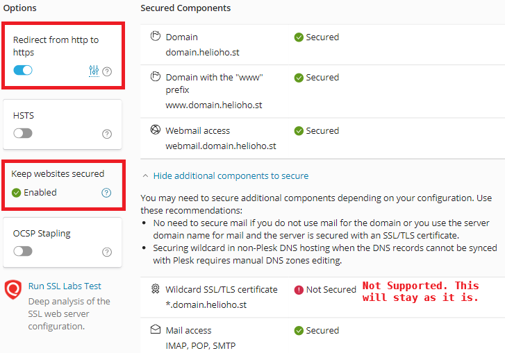

# SSL Certificate Problems

## Installing a Let's Encrypt SSL Certificate

## Navigate to the Let's Encrypt Settings

1) Navigate to the Let's Encrypt settings using the steps below:

__Login > Plesk > Websites & Domains > [ domain ] > Dashboard tab > Security section> SSL/TLS Certificates button > Let's Encrypt settings__

## Install the Certificate

2) Click on the `Install` button.

## Select Certificate Options

3) In addition to selecting the `Secure the domain name` option, we also recommend selecting the following options:
* Include a "www" subdomain for the domain and each selected alias
* Secure webmail on this domain
* Assign the certificate to the mail domain

**Note:** Securing webmail cannot be done during the 2 hours following domain creation, because it requires an Apache restart. Apache restarts every 2 hours, so if you're setting up SSL on a brand new account or a new domain that's just been added, you will need to return to these settings later to activate the webmail security feature.

4) Click on the `Get it free` button to install the certificate.

5) You should see that `Keep websites secured` is now `Enabled`

We also recommend activating the `Redirect from http to https` option

## Troubleshooting 

If you have issues with the Let's Encrypt SSL certificate on your domain or subdomain, here are some things to check:

## Check if the Certificate is Expired or Invalid 

If the certificate is expired or invalid:

* Reissue the certificate
* Wait a full 2 hours
* [Clear your cache](misc/clear-your-cache.md) to ensure the changes are applied correctly

## If the Certificate is NOT Expired

If the certificate is not expired:

* Unassign the certificate from the domain
* Reassign the certificate to the domain
* Wait a full 2 hours
* [Clear your cache](misc/clear-your-cache.md) to ensure the changes are applied correctly

## Further Support

If after following the above steps, waiting a full 2 hours, and [clearing your cache](misc/clear-your-cache.md), the problem is not fixed, please post a topic in the [Customer Support forum](https://helionet.org/index/forum/45-customer-service/?do=add). Make sure you provide your **username**, **domain name**, and any applicable **error message(s)** received.