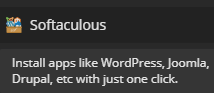

# FAQ

## Your homepage says "Professional-Grade Hosting", but your support sucks/isn't helping me/is run by a number of volunteers, what gives?‌

There is a difference between "Professional-Grade Hosting" and "Professional-Grade Customer Support". Most people are used to having dedicated customer support staff that will answer every little question; this comes standard with paid hosting. However, we don't do that here. Among the five of us, we have the collective knowledge and technical expertise of any other support staff, but in order for us to help you, we expect from you a certain competency. You must try to spell and use grammar correctly \(to the best of your ability\). You must provide necessary information \(e.g. username and domain name\). You must be able to read instructions, and you must be able to follow instructions. We will treat you with respect and professionalism if you follow these guidelines. We will probably be very annoyed if u tyep liek dis.‌

## I log in frequently but am still receiving inactivity emails, what gives?

To ensure that your logins are logged, login to [heliohost.org](https://www.heliohost.org) or [heliohost.org/login](https://heliohost.org/login/) at least once a month. Each time you do so your last login date is set to the current time. Your account will then remain active for another 30 days.

## Why must all posts on HelioNet be in English?

The support staff is fluent and reliable only in English.

## Why does HelioHost crash?

Currently we are running about 20000 different accounts on one server, Johnny. Sometimes, that's a bit too much for Johnny and some user will abuse resources, both causing the server to crash. We try to fix this as quickly as we can. Since the server and Plesk are handling such a high volume of users, errors are bound to come up. We also try to fix these ASAP. Also, when [djbob](misc/staff/ashoat.md) works on the server, he occasionally screws up, which also causes crashes.

## Why was my account suspended?

If you have not broken our [Terms of Service](hosting/terms.md), then you probably were suspended for [inactivity](/accounts/suspension-policy.md#inactivity-policy). Renew your account [here](http://www.heliohost.org/renew/). If you have overused cron or have broken any of the other ToS, shame on you.

It is also possible that this was an error in our system. If you suspect that this is the case, report the error in a new post [here](https://www.helionet.org/index/forum/81-suspended-and-queued-accounts/).

## Why does my new subdomain show a "Queued" page?

All domain and subdomain changes take approximately 2 hours to go into effect. Seeing the queued page is normal and only means the change hasn't taken effect yet. If you continuously see this page, try [clearing your browser cache](https://wiki.helionet.org/misc/clear-your-cache). Also, see this [post](http://www.helionet.org/index/topic/8604-web-page-update-delay/).

## Why can't I log in?

If you just registered, please wait **up to 2 hours** for your Plesk account to become active. If it has been longer than a full 2 hours, and still see an `Account Queued` page, try [refreshing your browser's cache](https://wiki.helionet.org/misc/clear-your-cache). If you are still experiencing problems, make sure you are entering your username in all lowercase letters, i.e. "wizard", not "Wizard" or "WIZARD".

## How do I keep my account active/from being suspended?

Login to [heliohost.org](https://www.heliohost.org) or [heliohost.org/login](https://heliohost.org/login/) at least once a month. Each time you do so your last login date is set to the current time. Your account will then remain active for another 30 days.

## What is a Daily Signup Limit and why is it stopping me from registering?

Each server has a daily limit for sign-ups so that it doesn't crash from all the people wanting to use HelioHost. Free signups on Johnny now reset [every 12 hours](https://helionet.org/index/topic/59660-midnight-and-noon/) at midnight UTC and noon UTC.

## What if I have $1 and don't want to wait to sign up?

We offer various [Donor Plans](https://heliohost.org/tommy/), so for a one-time donation of as little as $1, you can open an account any time of day.

## My account was deleted. Can I get my data back?

No. We do not keep backups of your data nor is it our responsibility to \(See the [Terms of Service](hosting/terms.md)\). You must backup your own data regularly. However, if your HelioHost Plesk account was deleted due to inactivity, feel free to create a new account.

## Can I have more than one account?

No. It's [one account per user](/accounts/suspension-policy.md#duplicate-accounts).

## How do I delete my hosting account?

To delete your HelioHost Plesk account, post a topic in the [Customer Service forum](https://helionet.org/index/forum/45-customer-service/?do=add).

To delete your HelioNet Forum account, post a topic in the [Contact HelioNet forum](https://helionet.org/index/forum/4-contact-helionet/?do=add).

## How do I change my main domain?

To change the main domain on your HelioHost Plesk account, post a topic in the [Customer Service forum](https://helionet.org/index/forum/45-customer-service/?do=add) and let us know what domain you want added.

As an alternative to changing your main domain, consider using parked, addon, and/or sub-domains. See this [wiki article](management/parked-addon-and-sub-domains.md) for more information.

## What are the nameservers for HelioHost?

* `ns1.heliohost.org`
* `ns2.heliohost.org`

## Can I PM an administrator for help?

No, do not PM the administrators expecting support unless we explicitly tell you to. Please use the [Customer Service forum](https://www.helionet.org/index/forum/45-customer-service/) instead. Also, in order for us to provide the best and most efficient support, please **provide your domain name, username, and server name up front** so we don't have to waste time asking. If you are sending your support request via email, use the email you signed up with.

## The server is slow/Feature XYZ doesn't work/Something's wrong with my account/etc.

Please post the issue in the [Customer Service forum](https://www.helionet.org/index/forum/45-customer-service/) and we will try to solve the problem. Also, in order for us to provide the best and most efficient support, please **provide your domain name, username, and server name up front** so we don't have to waste time asking. 

## Can Feature XYZ be installed?

Softaculous returned to Johnny and Tommy servers in [March 2024](https://helionet.org/index/topic/59683-softaculous-has-returned/), making it possible to install the latest version of 459 different software packages with just a single click.

To browse the available options, login to Plesk and select Softaculous from the menu:

 

If you need a system-wide feature installed, post your request on our [Customer Service forum](https://www.helionet.org/index/forum/45-customer-service/).

## Can I use SSH?

On hosting accounts, SSH access is disabled for security reasons.

If you require SSH access, it is only available on the [VPS Plans](https://heliohost.org/vps/).

## Your hosting SUCKS! So do YOU!!!

Please see [this](http://www.helionet.org/index/topic/4723-suspended/page__p__46231#entry46231).

## I still have a question about HelioHost.

Post in the [Questions forum](https://www.helionet.org/index/forum/48-questions/) and we'll try to help you the best we can.
