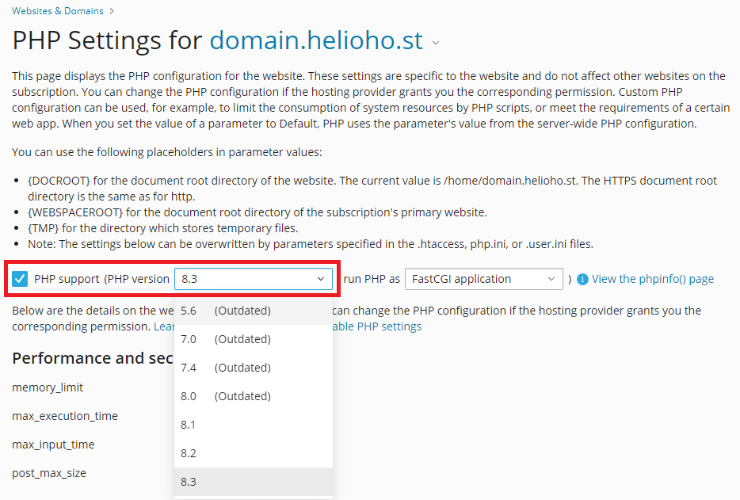
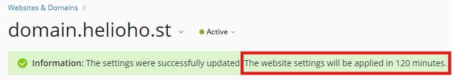

# PHP

PHP is the most popular scripting language on the Internet for a reason. It's easy to learn and easy to implement, yet is powerful enough to suit almost every task. Unlike some other languages, PHP is not explicitly linked with any programming paradigms, allowing for more flexible development. HelioHost offers the latest versions of PHP on all its hosting accounts. We are unique in that we offer PHP without safe mode, which is the more secure but less functional alternative that you'll find on most free hosts.

## PHP Versions Supported
<!-- TODO: Add Morty info here when released -->
### Johnny server
* PHP 5.6
* PHP 7.0
* PHP 7.4
* PHP 8.0
* PHP 8.1
* PHP 8.2
* PHP 8.3

### Tommy server
* PHP 5.6
* PHP 7.0
* PHP 7.4
* PHP 8.0
* PHP 8.1
* PHP 8.2
* PHP 8.3

## Learning PHP

`<?php` is the opening braces and `?>` is the closing braces for PHP.

Here is a sample hello world file.

```text
<?php
  echo "Hello World!";
?>
```
A good tutorial can be found here: [https://blog.udemy.com/php-tutorial/](https://blog.udemy.com/php-tutorial/)

## Change PHP Version

Follow the navigation steps below to change your PHP version inside Plesk:

#### Login > Plesk > [domain] > Dashboard tab > Dev Tools > PHP button > select PHP version from the dropdown menu



After the PHP version is changed, you will see a confirmation message that contains the timeframe for the change to take effect:



## PHP Version Changes Take Up To 2 Hours


PHP version changes take **up to 2 hours** to go into effect as they require an Apache restart. 
