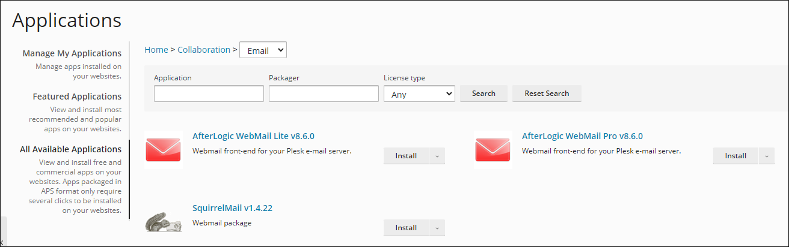
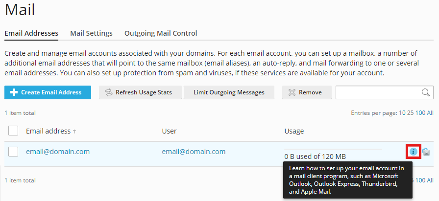

# Unlimited Email Accounts

HelioHost offers its users email accounts under their domains. This means that if your domain is `example.com`, you can create email accounts such as `yourname@example.com`. Unlike other free web hosts, HelioHost does not limit the amount of email accounts each domain can host. Since more email accounts do not burden our server, we see no good reason to restrict them.

## Webmail

Any email account you create on HelioHost can be used and managed through a web interface. HelioHost offers multiple webmail software options: 

### RoundCube

RoundCube comes preinstalled within the [Plesk](../management/how-to-access-plesk.md) control panel, and can be accessed by navigating to:

#### Login > Plesk > Mail 

### SquirrelMail and AfterLogic

SquirrelMail and AfterLogic (WebMail Lite v8.6.0 and WebMail Pro v8.6.0) can be user-installed inside Plesk, by navigating to:

#### Login > Plesk > Applications > All Available Applications > Collaboration > Email

## Supported Protocols

If you would prefer to use an email application (such as Outlook or Thunderbird) or your phone to read and send email, you can do this with your HelioHost email accounts. We offer compatibility with both the POP3 and IMAP protocols for incoming mail, and employ the standard SMTP protocol for outgoing mail. 

For more information on how to set this up, navigate to:

#### Login > Plesk > Mail > Email Addresses > [ your email address ] > Click the `i` button

#### Click on 'Manual setup' 
<!-- TODO: Add Morty as an option once released -->
When configuring mail clients, use your account server name (`johnny.heliohost.org` or `tommy.heliohost.org`) instead of your domain.

## Custom Mail

If you wish to use another mail server to handle your domain's email addresses, then HelioHost is the place for you. We allow users to [request configuration of custom MX records](../tutorials/dns-record-management/heliohost-dns-records/manage-heliohost-dns.md) for their domain, effectively forwarding all email load from HelioHost to a specified mail server.

## SpamAssassin

SpamAssassin is the most popular anti-spam solution for Linux systems and has won awards for its excellent performance. HelioHost offers SpamAssassin with all its accounts, allowing all users to prevent spam on their configured email accounts.

## SPF, DKIM, and DMARC Records 

### Set Up SPF, DKIM, and DMARC Records

To help improve the delivery of your emails, you can request that SPF, DKIM, and DMARC records be added to your account. Please create a new topic in our [Customer Support forum](https://helionet.org/index/forum/45-customer-service/?do=add) and include your hosting account **username** and **domain name** so we can set this up for you.

### Send a Test Email

After the SPF, DKIM, and DMARC records are set up, we recommend sending a test email to [https://www.mail-tester.com](https://www.mail-tester.com/) to check that everything is set up correctly. Your test email should be a regular email, such as your typical newsletter or a standard message (avoid using just "test" as the email content). If your score is below 10/10, please create a new topic in our [Customer Support forum](https://helionet.org/index/forum/45-customer-service/?do=add) and include **the full report link**, your hosting account **username**, and your **domain name** so we can help you fix any remaining issues.