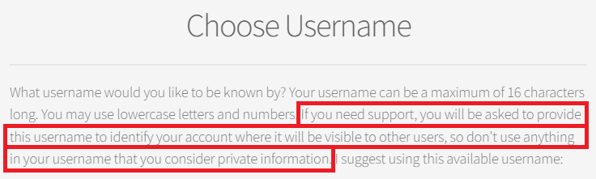
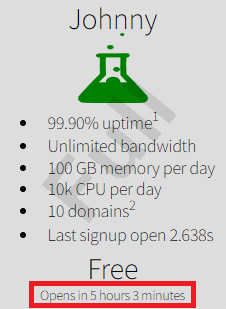
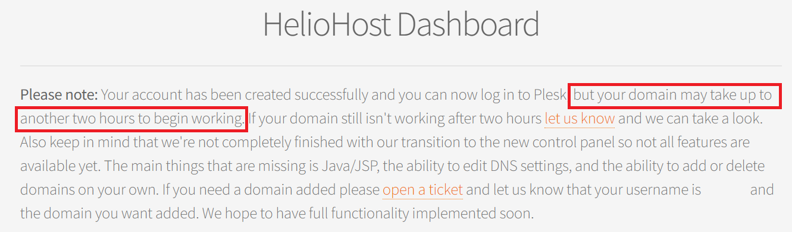

# Signing Up

## Before Signup

### Why should I choose Tommy?

Tommy is our flagship production server, one of our fastest and most stable, equipped with the newest hardware among our servers. Because of this stability, he is recommended if you want to host a production site.

Tommy is closed for free signups, but [Donor Signups](https://heliohost.org/tommy/) are always available.

### Why should I choose Johnny?

Johnny is our free server, still offering great stability, speed, and uptime. 

## During Signup

### Usernames are not private

When creating your account username, please note that if you need support, you will be asked to provide this username for account identification, where it may be visible to other users. Please avoid using any private information in your username.

### "That plan is already full for the day" message

To prevent the free Johnny server from getting overloaded with masses of new accounts, we put a limit on the number of people who can sign up. This limit resets [every 12 hours](https://helionet.org/index/topic/59660-midnight-and-noon/), at midnight UTC and noon UTC.

To find out when to sign up, check the `Opens in` text field, shown on the very bottom of the Johnny tile.  

You can also see how long the free signups slot was open for last time by checking the `Last signup open` text in the last bullet point on the tile.

#### Helpful Tips for Getting a Free Account on Johnny

 * Make sure your computer's or phone's time and time zone is set correctly, and synced up with a time server.
 * Make sure Javascript works in your browser. The bottom of the Johnny tile should count down as you get closer to noon and midnight UTC.
 * When the time gets down to 30 seconds or less, you can begin clicking on the Johnny tile:
    * If signups aren't open yet it will just give the red `That plan is already full for the day` message
    * If signups are open it will take you to a page to enter your email address.
* Once it asks you for your email address you have a spot reserved for at least an hour and you don't need to rush through the rest of the signup process.  

Free signups fill up fast, sometimes in even less than a second. If you miss the free signups timeslot, be ready to try again next time if needed.  


There are no exceptions to the free signup timeframes. If you cannot sign up during the 2 daily timeslots when Johnny is open for free signups, we offer various [Donor Plans](https://heliohost.org/tommy/), so for a one-time donation of as little as $1 USD, you can open an account on Tommy any time of day without needing to wait.


### What is HelioNet?

HelioNet is located at [helionet.org](https://helionet.org) and is a discussion board where users like yourself can request support. The friendly staff and the community will attempt to answer your questions as best as they can.


When you create your hosting account, a HelioNet forum account with the same username and password is created for you. 


If you need assistance, you can post on the HelioNet [Customer Support forum](https://helionet.org/index/forum/45-customer-service/?do=add) and the administrators can easily identify you by username.

Learn more about [the history of HelioNet](https://wiki.helionet.org/hosting/helionet).

## After Signup

### Up to 2 hours for activation


It can take **up to 2 hours** for your account to be fully active.


The HelioHost Dashboard will display a message advising you that your account has been created and you can login to Plesk. However, it may take **up to 2 hours** for your domain to begin working. 

In the meantime, your website may not load or display correctly, and file changes you make may not take effect. Please be patient and wait for **the full 2 hours** before assuming anything is broken.  

### Check account activation status

To check the status of your account and see an approximation of the activation completion time, go to [https://heliohost.org/status](https://heliohost.org/status/).  

If after **a full 2 hours**, you still see a message saying `HelioHost Account Queued` or are still seeing the Plesk default page, please [clear your cache](../misc/clear-your-cache.md).

### Using a non-HelioHost domain

You will need to add the following nameservers to your domain via your domain registrar's website:

* `ns1.heliohost.org`
* `ns2.heliohost.org`

To check that your nameservers have been properly configured, go to [http://byrondallas.heliohost.org/php/tools/dns\_records.php](http://byrondallas.heliohost.org/php/tools/dns_records.php).

### "Account failed to be created" email message

Please create a new topic in our [Customer Support forum](https://helionet.org/index/forum/45-customer-service/?do=add) and make sure you provide your hosting account **username** so we can investigate this for you.