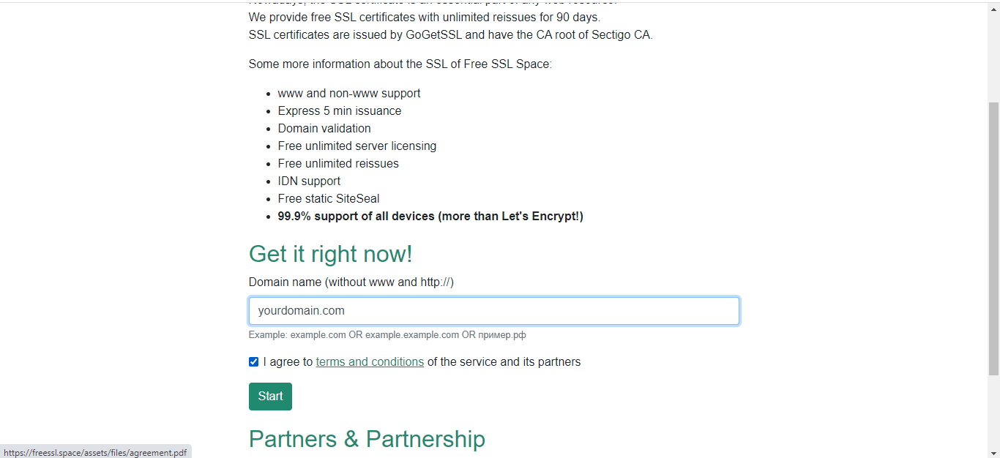
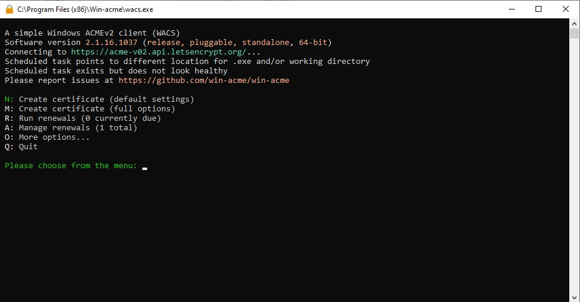
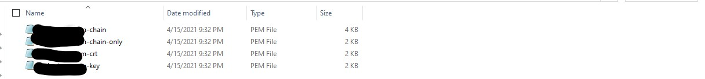
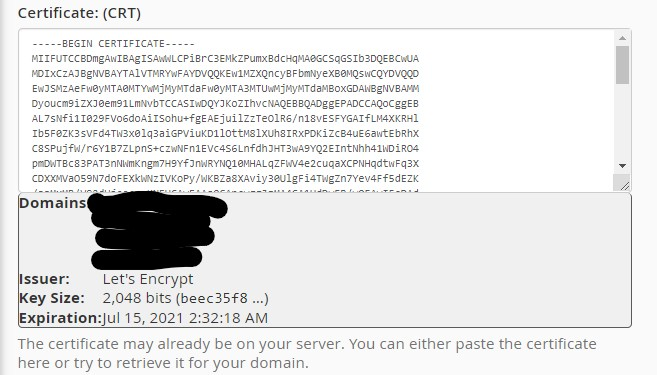

# Installing GoGetSSL Certificate via cPanel


This tutorial should only be done on Johnny! For Tommy and Ricky users, AutoSSL will generate a certificate for you within 24 hours and it will be renewed automatically.


## Step one: 

Head over to the [freessl.space](https://freessl.space) to get started. Enter your domain name into the domain field as below. Check the acceptance box and click on start.

\*\*\*\*

**Optional:** Go to your cPanel Interface and Generate a CSR and Private Key for your domain. This is optional since you can do a manual input.

Now just run wacs.exe \(preferably as administrator but you don't have to since you aren't using windows IIS\) and you are set for step 2.

## Step two: Create Certificate

You will then need to type in the letter M \(or N but we aren't using IIS\) and press enter. It will show you a bunch of different steps you can take. You can either choose to upload a CSR \(follow the steps I described above\) and a Private Key or you can just do a manual input. Choose the letter and press enter.

Now that you either entered the path of your CSR or you manually inputted your domains you can then move on to the next step.

Now it would tell you to choose a friendly name. Just choose a name that you can remember as cancelling, revoking, or renewing a certificate would require you to state the friendly name.

Then choose your preferred method of validation from the big list of validation methods.


Note: If you chose the method to create verification records manually you can't auto renew the domain.


If you chose manual input, after you choose a verification method you can also choose what kind of private key you want. You can choose RSA \(most preferred\) or ECC \(Elliptic Curve key\).

You then choose where you want to store the files. The most preferred way is a PEM encoded file.

You input the file location and press enter.

They validate your domain in your preferred method and when you finish the certificate is created and stored in your preferred way.

## Step three: Install Certificate

You go to where your certificate is stored.

You go to your cPanel &lt; SSL/TLS &lt; Certificates and you upload the crt file \(you can upload all three but that's optional\).

You then go to SSL/TLS &lt; Private Keys and upload your generated private key \(you don't have to do this if you generated a CSR as a Private Key is also generated\).

When you finish uploading the Certificate and the Private Key. You go to the Manage SSL Sites section.

You go and select your domain from the dropdown box.

Then click on Browse certificates and select the one you generated from win-acme. Click on the correct on and press use certificate.

Make sure that the certificate is the correct by looking at the rectangle underneath the textbox.

Everything including the CABUNDLE \(certificate authority bundle\) should all be autofilled. Just click on Install Certificate and you are all set.

Note: On Johnny it can take up to 2 hours for your SSL certificate to start working.

You should now have SSL up and running! HTTPS can be used on the domain/subdomains you specified.

## Additional steps \(optional\)

### Certificate expiry and renewal

Certificates issued by Let's Encrypt, such as the one\(s\) you just generated with win-acme expire after 90 days. Even though it auto-renews you still have to click on renew in the wacs.exe interface. Set a reminder to renew the certificate at an appropriate date.

### Forced HTTPS

By default, pages can be accessed either unencrypted \(HTTP\) or encrypted \(HTTPS\). `.htaccess` rules can be used to force HTTPS throughout the site or on certain pages. More information can be found on [this httpd wiki page](https://wiki.apache.org/httpd/RewriteHTTPToHTTPS).

