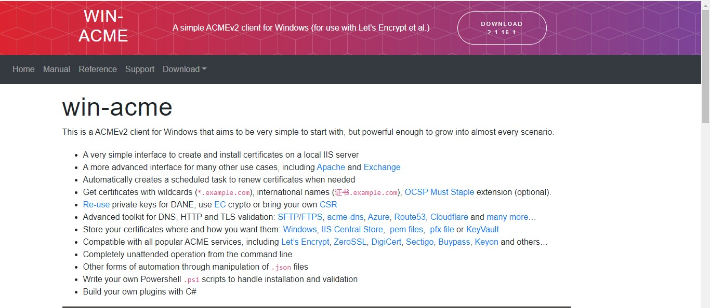
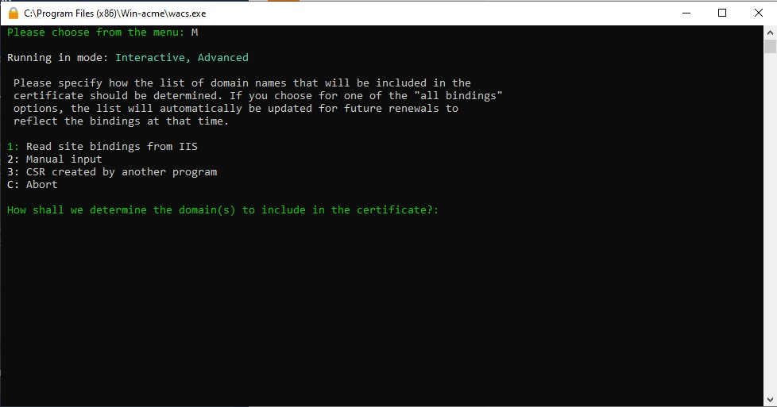
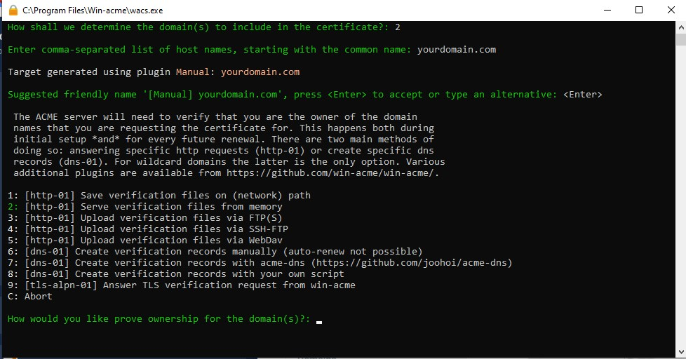
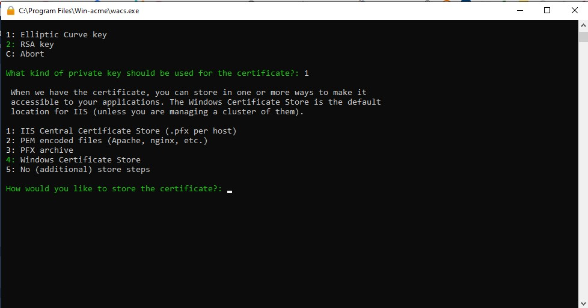
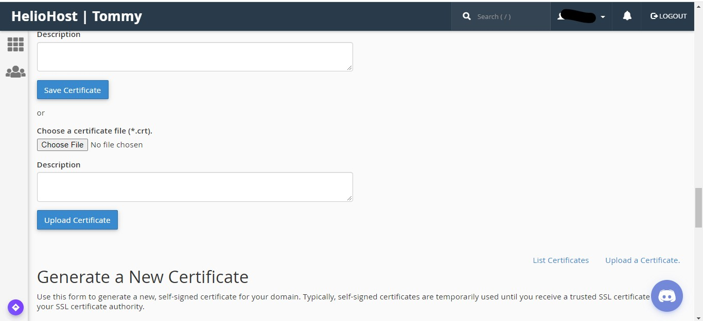

# Installing Free SSL Certificate via cPanel \(that autorenews\)


If you are on Mac or Linux, you can easily install Certbot as an alternative. Because it is so popular, pretty much every SSL CA has a documentation on Certbot. To install Certbot go here: [Certbot and Let's encrypt](https://certbot.eff.org/). The documentation for Zerossl is here: [Zerossl](https://zerossl.com/documentation/acme/) and Buypass is here: [Buypass](https://community.buypass.com/t/k9r5cx/get-started)



If you want a 180 day SSL \(which you probably won't need considering the 90 day SSLs auto-renews\), then just go to the settings.json file and change the DefaultBaseUri to: [https://api.buypass.com/ acme/directory](https://api.buypass.com/acme/directory) instead of: [https://acme-v02.api.letsencrypt.org/](https://acme-v02.api.letsencrypt.org/). Don't do this method if you want more than 5 multidomains or wildcards.



This tutorial should only be done on Johnny! For Tommy and Ricky users, AutoSSL will generate a certificate for you within 24 hours and it will be renewed automatically.


## Prerequisites:

* Have a website that is online
* Have a windows computer \(Mac and Linux users can follow the above tutorial.
* Have at least 100 MB of storage
* Have a 64bit \(32bits need to download the x86 version\) computer

## Choose a CA \(Certificate Authority\):

Before you generate an SSL Certificate you will need to choose your CA. It can be Sectigo, Digicert, SSL.com \(etc.\). Here are the ones that are free and the pros and cons.

### Let's Encrypt \(most recommended\):

Let's encrypt is the most popular SSL CA and I can see why. Let's encrypt provides unlimited 90 day multidomains, single domains, and wildcards all free of charge. Plus you don't need to fuss around with code and scripts or create an account since Let's Encrypt is win-acme and Certbot's default CA.

#### Pros:

* Free and Unlimited
* Easy
* Multidomains up to 250 SANs
* Wildcards
* Let's encrypt is win-acme's default CA, so no messing around with scripts

#### Cons:

* Valid for only 90 days \(however there is autorenew\)
* Because it is so popular, people who see your SSL Certificate would not trust your website that much since it is so free \(however a lot of people won't take the effort to check the SSL Certificate\).

### Zerossl:

Zerossl used to issue Let's Encrypt SSLs. Now it is their own CA. Zerossl also provides unlimited wildcards and multidomains \(as long as you use acme\). Plus it has a Sectigo root \(which is more trustworthy than the  DST Root CA X3 \(going to be  ISRG Root X1\)\). The only problem is that you will need to signup for an account at Zerossl.

#### Pros:

* Free and Unlimited
* Easy \(but takes longer since you have to signup\)
* Multidomains up to 250 SANs
* Wildcards
* Sectigo Root
* Support Team \(can take up to a day to reply but still helpful\)

#### Cons:

* Valid for only 90 days \(however there is autorenew\)
* You will need to signup for an account at Zerossl

### Buypass Go SSL:

Buypass is a fairly old, but little known CA that provides paid DV, OV, and EV SSLs. They also provide a free 180 day SSL called the Buypass Go SSL. Similar to Zerossl, it can only be issued \(for free\) using acme.

#### Pros:

* Free and Unlimited
* Easy
* Valid for 180 days
* Multidomains

#### Cons:

* Multidomains up to 5 SANs
* No wildcards
* Needs a CAA record pointing to Buypass with issue hostnames

To connect to Zerossl, just go to the settings.json file in the folder and change the defaultbaseuri to: [https://acme.zerossl.com/v2/DV90](https://acme.zerossl.com/v2/DV90). To connect to Buypass, do the same thing as Zerossl but instead change the defaultbaseuri to: [https://api.buypass.com/acme/directory](https://api.buypass.com/acme/directory).


## Step One: Download Win-acme

Head over to the [win-acme.com](https://win-acme.com) to get started. Download the package \(we recommend the pluggable but you can download the trimmed version if you want\)



**Important:** Make sure to unzip it to the program files folder so the scheduled tasks can run and the certificate creation won't fail.

**Optional:** Go to your cPanel Interface and Generate a CSR and Private Key for your domain. This is optional since you can do a manual input.

## Step two: Create Certificate

Now run wacs.exe \(preferably as administrator but that is optional considering we aren't using windows IIS\) either using the app or by by using the command line. If you want to do additional commands then we would recommend using the command line. If you are just generating a simple let's encrypt SSL, using the app is easier and faster. If you want to use the command line \(or just curious\), open command prompt \(preferably as administrator but because we aren't using IIS that is optional\) and run the command below.

```text
cd C:\Program Files\win-acme
wacs.exe
```

You will then need to type in the letter for the command you want. Because you aren't using IIS you will need to choose M \(Create Certificate \(with full options\)\). It will show you a bunch of different steps you can take. You can either choose to upload a CSR \(follow the steps I described above\) and a Private Key or you can just do a manual input. Choose the letter and press enter.



Now that you either entered the path of your CSR  or manually inputted your domains you can then move on to the next step.

Now it would tell you to choose a friendly name. Just choose a name that you can remember as cancelling, revoking, or renewing a certificate would require you to state the friendly name.

Then choose your preferred method of validation from the big list of validation methods.

The methods that do work are 1, 3, 4, 5, 6, 7, 8, 9. The other methods only work on IIS.

We recommend that you choose 7 , create verification records with acme-dns method. The reason is because it is the easiest \(the one with your own script is too complicated\), the most reliable \(file upload sometimes doesn't work and \(s\)ftp\(s\) may fail\), and has autorenew \(manual verification doesn't have autorenew\). When it prompts for the acme-dns URL copy and paste this URL on it: https://auth.acme-dns.io/register


Note: If you chose the method to create verification records manually you can't auto renew the domain.




 If you chose manual input, after you choose a verification method you can also choose what kind of private key you want. You can choose RSA \(most preferred\) or ECC \(Elliptic Curve key\).

You then choose where you want to store the files. The most preferred way is a PEM encoded file.



You input the file location and press enter.

They validate your domain in your preferred method and when you finish the certificate is created and stored in your preferred way.

## Step three: Install Certificate 

You go to your cPanel &lt; SSL/TLS &lt; Certificates and you upload the crt file \(you can upload all three but that's optional\).

You then go to SSL/TLS &lt; Private Keys and upload your generated private key \(you don't have to do this if you generated a CSR as a Private Key is also generated\).



When you finish uploading the Certificate and the Private Key. You go to the Manage SSL Sites section.

You go and select your domain from the dropdown box.

Then click on Browse certificates and select the one you generated from win-acme. Click on the correct on and press use certificate.

Make sure that the certificate is the correct by looking at the rectangle underneath the textbox.


Everything including the CABUNDLE \(certificate authority bundle\) should all be autofilled. Just click on Install Certificate and you are all set. 

Note: On Johnny it can take up to 2 hours for your SSL certificate to start working.

You should now have SSL up and running! HTTPS can be used on the domain/subdomains you specified.

## Additional steps \(optional\)

### Certificate expiry and renewal

Free certificates issued by Let's Encrypt, such as the one\(s\) you just generated with win-acme expire after 90 days. Make sure to set a renewal time so you don't forget.

To renew it, just go to your wacs.exe and run renewals. It should auto-renew you SSL \(unless you chose the create verification records manually.

### Forced HTTPS

By default, pages can be accessed either unencrypted \(HTTP\) or encrypted \(HTTPS\). `.htaccess` rules can be used to force HTTPS throughout the site or on certain pages. More information can be found on [this httpd wiki page](https://wiki.apache.org/httpd/RewriteHTTPToHTTPS).

