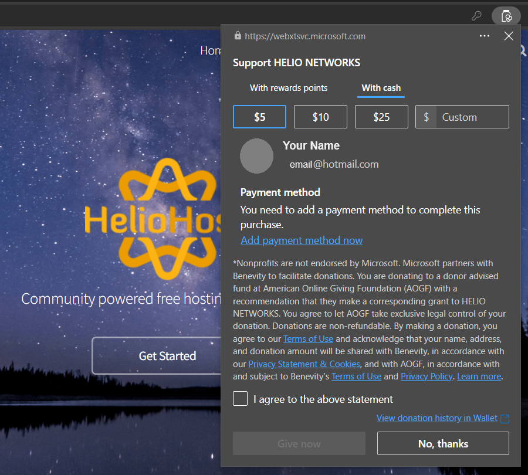
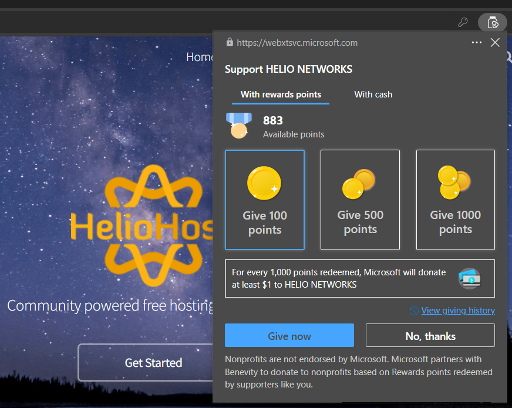

# How You Can Help

HelioHost provides community-powered free hosting for everyone. There are several ways you can help support us.

## Make a Donation

### Donate via PayPal or Crypto

The best way to help us keep providing free hosting is by donating at [heliohost.org/donate](https://heliohost.org/donate/). You can donate via PayPal or the cryptocurrencies listed on the page.

### Corporate Donation Matching

A lot of employers will make a donation match to approved 501(c)(3) charities, which is what HelioHost is. So, if you donate $100 your job might match your donation and send another $100 to us. You can ask at work to see if your company has a donation matching program like this, and then search for us under `Helio Networks` or `HelioHost`.

### Donate via Charityvest

You can [donate to Helio Networks via Charityvest](https://www.charityvest.org/charity/helio-networks-d5b1f0df-8759-41c4-91b3-e9e75099579d) and it will be fee free, since HelioHost is registered with the PayPal Giving Fund, which is the method Charityvest uses to [enable electronic payments to charities](https://www.charityvest.org/blog/charityvest-implements-paypal-grant-payments-to-enable-electronic-payments-to-charities).

### Donate via Facebook 

In some countries, you can donate on the [HelioHost Facebook page](https://www.facebook.com/HelioHost.org).

### Donate via Brave browser

HelioHost is a Verified Creator in the Brave Creators program. This means that if you use the Brave web browser, you can now donate to us by clicking the triangle shape while viewing [heliohost.org](https://heliohost.org/) or [helionet.org](https://helionet.org/) or Plesk, and then clicking Send Contribution. If you have auto-contribute enabled, you can donate to us simply by using our website and forum as you normally would.

If you're not familiar with the Brave browser, check out [PrivacyTests.org](https://privacytests.org/). Brave is based on Chromium just like Chrome and Edge, but has a built in ad-blocker and annoyance blocker that is better than most extensions you can install on any of the other browsers. You can even get paid to visit websites if you enable the option in the settings and set up a crypto wallet.

#### Turn Brave Ad-Blocker Off

Using Brave's ad-blocker is a great way to support us with donations instead of viewing ads. However, as a non-profit fully funded by advertising revenue and donations, we appreciate you viewing our ads to help us stay in business. To double your donations from Brave, you can disable the Brave shields on our pages to view our ads, while also auto-contributing.

### Donate via Edge browser

In some countries, you can donate using the Edge browser by visiting [heliohost.org](https://heliohost.org/) and clicking the `Donate` button. 

#### Donate Cash in Edge

You can choose to donate cash via Benevity:

#### Donate Rewards Points in Edge

You can choose to donate using Microsoft Rewards points via Benevity.

  
Please note that: 
* Donations sent from Microsoft Rewards [can take **at least 2 months** to be verified](https://helionet.org/index/topic/62006-hh561624-can-i-donate-via-microsoft-rewards/#findComment-280045)
* [Donations of 1000 points or less just disappear](https://helionet.org/index/topic/62006-hh561624-can-i-donate-via-microsoft-rewards/#findComment-284853)

| Microsoft Points Donated | Amount Received by HelioHost |
| :----------------------- | :--------------------------- |
| 1000 points              | 0 cents                      |
| 3000 points              | 5 cents                      |
| 5000 points              | 10 cents                     |
| 50,000 points            | $1 USD for a Tommy Invite    |  
  

## Allow Ads on Our Sites
<!-- TODO: Add Ricky once he is rebuilt. -->
If you don't view our ads, we don't earn any ad revenue from your visits to our site. It's free to allow our ads, and we promise they're not too annoying. Who knows? You might even see an ad for something amazing that you want to check out. Make sure to add our sites below to your to your ad-blocker "Allow List": 
* [heliohost.org](https://heliohost.org/)
* [helionet.org](https://helionet.org/)
* [morty.heliohost.org](https://morty.heliohost.org/)
* [tommy.heliohost.org](https://tommy.heliohost.org/)
* [johnny.heliohost.org](https://johnny.heliohost.org/)
* [wiki.helionet.org](https://wiki.helionet.org/)

## Use Our Affiliate Links

HelioHost has an affiliate agreement with Namecheap, so if you're in the market for a new domain we highly recommend purchasing it from them. Once you set the nameservers to `ns1.heliohost.org` and `ns2.heliohost.org`, we can host the website on your brand new domain for you. Click the banner below to use our affiliate link to shop for your new domain:


After checking if your preferred domain name is available, there will sometimes be a Promo Code you can use at checkout, to get a very low price for the first year.


## Spread the Word

Spread the word about our community-powered free hosting service with some graphics to put on your websites.

### Put our Banner on your Site

You can find some user-contributed HelioHost banner graphics to use in [this HelioNet forum thread](https://helionet.org/index/topic/28401-put-our-banner-on-your-site/).

### Put our Badge on your Site

Find a user-contributed configurable HelioHost badge to add to your site in [this HelioNet forum thread](https://helionet.org/index/topic/31107-badge/).

## Recommend Us

### Recommend us on AlternativeTo

If you can think of a competitor to what we offer, find them on [AlternativeTo.net](https://alternativeto.net/) and make sure HelioHost is listed on their page as an alternative option.

To give HelioHost an upvote as an alternative to our competitors, use the links in [this HelioNet forum thread](https://helionet.org/index/topic/28394-upvote-heliohost-on-alternativetonet/#comment-129850)

### Mention us on Quora

Answer a question with a description of HelioHost on [Quora.com](https://www.quora.com/search?q=Web%20Hosting%20Providers) (Must be logged in to your Quora account to view this link.)

## Review Us

Write a review about HelioHost at the sites below:

* [Sitejabber](https://www.sitejabber.com/reviews/heliohost.org)

* [Free-Webhosts.com](http://www.free-webhosts.com/reviews/add-review.php?hostname=HelioHost)

* [WHTop](http://www.whtop.com/review/heliohost.org#reviews-open)

## Social Media

### Post about us on Facebook

Let your Facebook friends know about us by posting on your timeline using [this link](https://www.facebook.com/share.php?u=http://www.heliohost.org/).

### Mention us on X (formerly Twitter)

Let your followers know you're hosting your website with us by using `@HelioHost` in your tweet. You can use [this link](https://twitter.com/intent/tweet?text=My%20website%20is%20on%20%40heliohost%20the%20community%20powered%20free%20web%20host%20for%20everyone.%20Get%20your%20own%20free%20website%20at%20http%3A%2F%2Fheliohost.org%2F).

## Join the Community

HelioHost is community powered. We are active on the platforms below, and welcoming to new users. Please ensure you follow our simple rules. 

### [HelioNet forum](https://helionet.org/index/) 

Forum users must follow [these rules](../hosting/terms.md#helionet-terms)

### [HelioHost Discord channel](https://discord.com/invite/y8QJfXg)

Channel users must follow [these rules](https://discord.com/channels/398197622168616962/419629456794058752/1101198173386571816)