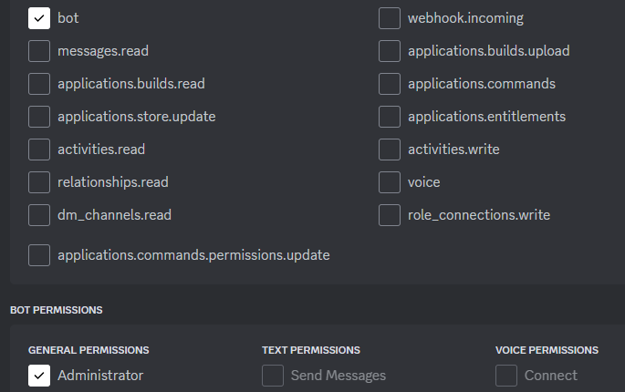

# Discord Bot

## Preface

This guide will work on any of the HelioHost servers.

Python is an interpreted, object-oriented, high-level programming language with dynamic semantics. Its high-level built in data structures, combined with dynamic typing and dynamic binding, make it very attractive for Rapid Application Development, as well as for use as a scripting or glue language to connect existing components together. Python's simple, easy to learn syntax emphasizes readability and therefore reduces the cost of program maintenance. Python supports modules and packages, which encourages program modularity and code reuse.

The Discord app works with desktop and mobile platforms, combining the features of a chat lobby, a message board and a VoIP chatting system into one app that's not going to hog resources on your phone or PC. Discord's popularity has only multiplied in recent years, with the app now reaching over 90 million registered users.

Bots and apps are the lifeblood of the Discord development community. They come in all shapes and sizes, from small hobby projects for your server with friends, to huge projects that live in hundreds of thousands of servers. We love seeing the unique, fun, and sometimes downright strange \(in a good way\) creations that come from our community.

## How to get Started with a Discord Bot

First you'll need to have a Discord account, and a Discord channel that you'll add the bot to later. Here's a good guide to get started:

[How to Make, Set Up, and Manage a Discord Server](https://www.howtogeek.com/364075/how-to-create-set-up-and-manage-your-discord-server/)

<!--  -->

### Create the Bot

Once you have your Discord server all set up it's time to create the bot through Discord's site. Go to [https://discordapp.com/developers/applications](https://discordapp.com/developers/applications) and make sure you're logged in. Then click `New Applcation` in the top right.


Type a name and hit create. I decided to name my bot `HelioBot`.

### Add the Bot to your Discord Server

Click `OAuth2` on the left navigation.


Then check the bot box under `SCOPES`, and scroll down and select `Administrator` under `BOT PERMISSIONS`. You could select the exact permissions that your bot needs one by one, but for this simple example it's easier to just allow the bot permission to do everything.



Click copy next to the URL that is generated and open that URL in a new tab. Then, select your Discord server from the dropdown menu.


Click `Authorize` and complete the reCAPTCHA to add the bot to the Discord server. If you go to your Discord now you can see the bot on the offline user list.


### Write the Bot Script in Python

Log in at [https://www.heliohost.org/login/](https://www.heliohost.org/login/) and continue to Plesk. Then load up the file manager.


In the top left corner click the `+` plus sign, and select `Create File`.


Then type the name of your new file: `heliobot.py`.


You want to create this bot in your home directory so random hackers and bots on the internet can't access it directly. Make sure it says `Add a file to: /` not `Add a file to: /httpdocs` or any other folder.

Scroll down in the file manager and clcik on the new `heliobot.py` file to edit it. Then copy/paste this code in:

```python
#!/usr/bin/python3.10

import os
import discord
from dotenv import load_dotenv

load_dotenv()
token = os.getenv('DISCORD_TOKEN')

import certifi
os.environ["SSL_CERT_FILE"] = certifi.where()

client = discord.Client(intents=discord.Intents.default())

class MyClient(discord.Client):
    async def on_ready(self):
        print(f'Logged in as {self.user} (ID: {self.user.id})')
        print('------')

    async def on_message(self, message):
        # we do not want the bot to reply to itself
        if message.author.id == self.user.id:
            return

        if message.content.startswith('!hello'):
            await message.reply('Hello!', mention_author=True)


intents = discord.Intents.default()
intents.message_content = True

client = MyClient(intents=intents)
client.run(token)
```

The first line is called the shebang, and it tells the system which version of python you want to use. Johnny and Tommy also have Python 2.7, and Python 3.6, but we recommend using Python 3.10 like in the example.

Once you have your code copy/pasted in click save in the bottom left corner. Now we need the bot to be executable so in the file manager click the `rw- r-- r--` on the heliobot.py line. 


Check all three of the `Execute/Search` boxes so it looks like this and then click save in the bottom left corner.


Now we need to provide our Discord token to the bot so click the `+` plus sign, and select `Create File` again and this time name the file `.env`.


**Make sure you start the filename with a period.** It's easy to miss that in the screenshot. This file needs to be in the **same** directory as your Python script.

Go back to the Discord bot page and click bot on the left navigation again.


The first thing we need to do on this page is enable `Presence Intent`, `Server Members Intent`, and `Message Content Intent`. If you're sure your bot doesn't need all three of these enable just what you need, but for simplicity of this guide we're going to enable all three, and then save the changes.


On the same page click the `Reset Token` button, and then copy/paste the token.


If you ever think someone has gotten your token, for instance if you posted it on a public wiki like I just did, be sure to come back to this page and reset it. Anyone who has your token can do whatever permissions you granted your bot to your server. Now you need to paste this token into your `.env` file that you created. So go back to the Plesk file manager and click the `.env` file to edit it. Paste the token into the file like this:


Make sure the line starts with `DISCORD_TOKEN=` like that. Then click `Save Changes` and close the tab. Saving your token separate from your Python code is good practice because this way you can share the code on GitHub or something like that without worrying about people getting access to your bot.

### Starting and Stopping Your Bot

You have a functional bot now, but you need a way to start and stop it.


Side note: Previous versions of this guide used Python scripts to start and stop the Discord bot. Unfortunately, the people who wanted to write their bot in Node.js always complained that they didn't want to use Python for anything. Likewise, if we used Node.js to start and stop the bot, the Python people would inevitably complain about not wanting to use Node.js for anything. Therefore, we wrote the start and stop scripts in Bash CGI to make absolutely sure that no one is happy.


We'll use Bash CGI to do that so you can control your bot through your web page. With the file manager, navigate to `/httpdocs` and create a new directory called `bot_control`.


Now create a new file named `.htaccess` in the `/httpdocs/bot_control` directory.


Paste this code into the new `.htaccess` file.

```
Options +ExecCGI
AddHandler cgi-script .sh
DirectoryIndex index.sh
```

Next create a new file named `index.sh` in the `/httpdocs/bot_control` directory.


Paste in this code into the new file:

```bash
#!/bin/bash

# edit these to match your username, main domain, and bot filename
username="krydos"
main_domain="krydos.heliohost.org"
bot_name="heliobot.py"

###################################################################

printf 'Content-Type: text/html\n\n'
temp=`ps axo user:16,pid,pcpu,pmem,vsz,rss,tty,stat,start,time,command|grep -v grep|grep "^$username"`
running=`echo "$temp"|grep -c "$bot_name"`
file_base=`echo $bot_name|tr -cd "a-zA-Z0-9"`
log_name="$file_base.txt"
if [ "$QUERY_STRING" == "" ]; then
    if [ $running -ne 0 ]; then
        mem_kb=`echo "$temp"|grep "$bot_name"|awk '{print $6}'`
        mem_mb=$( echo "scale=2;$mem_kb/1024"|bc )
        mem_24=$( echo "scale=2;$mem_kb*1440/1048576"|bc )
        echo "$bot_name is running. <a href='?action=stop'>Stop</a><br>Current memory usage: $mem_mb MB<br>Estimated 24 hour usage: $mem_24 GB - "
    else
        echo "$bot_name is not running. <a href='?action=start'>Start</a> - "
    fi
    echo "<a href='https://heliohost.org/dashboard/load/' target='_blank'>Check Load</a><br><br>Logs: <a href='?action=clear'>Clear Logs</a> - <a href='/bot_control/$log_name'>Full Logs</a><pre>"
    tail -30 /home/$main_domain/httpdocs/bot_control/$log_name
    echo "</pre><script>reloading = setTimeout('window.location.reload();', 10000);</script>"
fi
ts=`date +"%Y-%m-%d %H:%M:%S"`
if [ "$QUERY_STRING" == "action=stop" ]; then
    echo "[$ts] Stopping $bot_name." >> /home/$main_domain/httpdocs/bot_control/$log_name
    pid=`echo "$temp"|grep "$bot_name"|tail -1|awk '{print $2}'`
    if [ ${#pid} -ne 0 ]; then
        kill $pid
    fi
    echo "Stopping $bot_name...<script>window.location.replace('/bot_control/');</script>"
fi
if [ "$QUERY_STRING" == "action=start" ]; then
    echo "[$ts] Starting $bot_name." >> /home/$main_domain/httpdocs/bot_control/$log_name
    /usr/bin/python3.10 -u /home/$main_domain/$bot_name >> /home/$main_domain/httpdocs/bot_control/$log_name 2>&1 &
    echo "Starting $bot_name...<script>window.location.replace('/bot_control/');</script>"
fi
if [ "$QUERY_STRING" == "action=clear" ]; then
    cat /dev/null > /home/$main_domain/httpdocs/bot_control/$log_name
    echo "Clearing logs...<script>window.location.replace('/bot_control/');</script>"
fi
exit 0
```

Be sure to edit the three variables at the top of the file to match your username, main domain, and bot filename.

Now, we need to set the permissions of this `index.sh` file to be executable. On the file manager click the `rw- r-- r--` and check all the `Execute/Search` boxes just like we did the heliobot.py file earlier.


### Test It Out

Now everything should be ready to be tested. Open your browser and go to `yourdomain.helioho.st/bot_control/` and when you click Start it should start the bot. You can check if the bot is running by going to Discord and seeing if HelioBot is showing up as online now. If it is, test it out by typing the command:

```text
!hello
```

It should respond to you.


If it doesn't work go back and check all the steps again to make sure you did everything correctly. You can also check out the logs in the bot_control dashboard to see if there is any errors listed. For example, if you try to import a modules that isn't already installed it will give an error like this:


If you can't figure out what is wrong let us know by opening [a customer service ticket](https://helionet.org/index/forum/45-customer-service/?do=add).

### Watch Your Load

On Johnny and Tommy you are limited to 100 GB of memory and 10000 CPU per day, and bots use a lot of system resources so we recommend keeping an eye on your load if you don't want to get suspended. On the bot_control dashboard it shows the current memory usage, and the estimated usage over the next 24 hours if your bot continues using the same amount of memory.


If you followed the guide exactly your bot will use about 50 GB or memory per day, which is half of your allowed amount. If you edit your bot code, make your bot more complicated, and import more modules it will increase the memory usage though. Obviously if you have some sort of memory leak it could easily allow your bot to continue consuming more and more memory until you get suspended.

If everything is working you can shut your bot down by clicking the Stop button on the bot_control dashobard. It's a good idea to keep your bot offline if you don't need it so you don't cause too much load. If you're having trouble staying under the limits you could also consider [moving to a VPS](https://heliohost.org/vps/) where you have root SSH access, dedicated memory and CPU, and no load limits.
