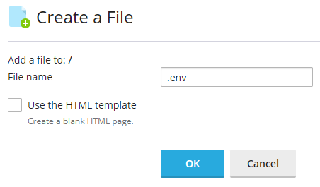
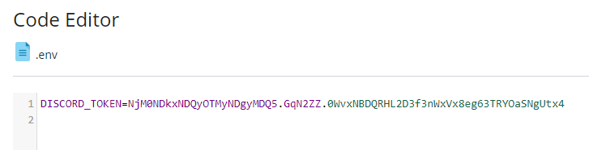

## Preface

This guide will work on any of the HelioHost servers.

Python is an interpreted, object-oriented, high-level programming language with dynamic semantics. Its high-level built in data structures, combined with dynamic typing and dynamic binding, make it very attractive for Rapid Application Development, as well as for use as a scripting or glue language to connect existing components together. Python's simple, easy to learn syntax emphasizes readability and therefore reduces the cost of program maintenance. Python supports modules and packages, which encourages program modularity and code reuse.

The Discord app works with desktop and mobile platforms, combining the features of a chat lobby, a message board and a VoIP chatting system into one app that's not going to hog resources on your phone or PC. Discord's popularity has only multiplied in recent years, with the app now reaching over 90 million registered users.

Bots and apps are the lifeblood of the Discord development community. They come in all shapes and sizes, from small hobby projects for your server with friends, to huge projects that live in hundreds of thousands of servers. We love seeing the unique, fun, and sometimes downright strange \(in a good way\) creations that come from our community.

## How to get Started with a Discord Bot

First you'll need to have a Discord account, and a Discord channel that you'll add the bot to later. Here's a good guide to get started:



### Create the Bot

Once you have your discord server all set up it's time to create the bot through discord's site. Go to [https://discordapp.com/developers/applications](https://discordapp.com/developers/applications) and make sure you're logged in. Then click `New Applcation` in the top right.


Type a name and hit create. I decided to name my bot `HelioBot`.

### Add the Bot to your Discord Server

Click `OAuth2` on the left navigation.


Then check the bot box under `SCOPES`, and scroll down and select `Administrator` under `BOT PERMISSIONS`. You could select the exact permissions that your bot needs one by one, but for this simple example it's easier to just allow the bot permission to do everything.


Click copy next to the URL that is generated and open that URL in a new tab. Then, select your discord server from the dropdown menu.


Click `Authorize` and complete the reCAPTCHA to add the bot to the Discord server. If you go to your Discord now you can see the bot on the offline user list.


### Write the Bot Script in Python

Log in at [https://www.heliohost.org/login/](https://www.heliohost.org/login/) and continue to Plesk. Then load up the file manager.


In the top left corner click the `+` plus sign, and select `Create File`.


Then type the name of your new file: `heliobot.py`.


You want to create this bot in your home directory so random hackers and bots on the internet can't access it directly. Make sure it says `Add a file to: /` not `Add a file to: /httpdocs` or any other folder.

Locate the new file, and right click on it. Select `Edit`, and click `Edit` again on the box that pops up. Then copy/paste this code in:

```python
#!/usr/bin/python3.7

import os
import discord
from dotenv import load_dotenv

load_dotenv()
token = os.getenv('DISCORD_TOKEN')

client = discord.Client()

@client.event
async def on_member_join(member):
    await member.create_dm()
    await member.dm_channel.send(
        f'Hi {member.name}, welcome to my Discord server!'
    )

@client.event
async def on_message(message):
    if message.author == client.user:
        return

    if message.content == '!heliobot':
        await message.channel.send(f'Hello, how are you today?')

client.run(token)
```

The first line is called the shebang, and it tells the system which version of python you want to use.


Tommy and Johnny have `python3.7` but on Ricky you would have to change it to `python3.9`!


Once you have your code copy/pasted in click save changes in the top right corner, and the close the tab. We need the bot to be executable so right click on it in the file manager and select `Change Permissions`.


Set the permissions to `755`.


Now we need to provide our discord token to the bot so click +file again and this time name the file `.env`.



**Make sure you start the filename with a period.** It's easy to miss that in the screenshot. This file needs to be in the **same** directory as your Python script.

```text
/home/username/.env
```

Go back to the Discord bot page and click bot on the left navigation again.


Locate the token for your bot and click `Copy` on it.


If you ever think someone has gotten your token, for instance if you posted it on a public wiki like I just did, be sure to come back to this page and regenerate it. Anyone who has your token can do whatever permissions you granted your bot to your server. Now you need to paste this token into your `.env` file that you created, but likely you won't even be able to see your `.env` file because files that start with a dot in Linux are considered hidden files. So on the file manager, click `Settings` in the top right corner and make sure you have hidden files shown.


Now you should be able to see the `.env` file, right click on it, and select `Edit`. Then paste the token into the file like this:



Make sure the line starts with `DISCORD_TOKEN=` like that. Then click `Save Changes` and close the tab. Saving your token separate from your code is good practice because this way you can share the code on GitHub or something like that without worrying about people getting access to your bot.

### Starting and Stopping Your Bot

You have a functional bot now, but you need a way to start and stop it. We'll use CGI to do that so you can control your bot through your web page. With the file manager, navigate to `public_html/cgi-bin` and create a new file called `start.py`.

```text
/home/username/public_html/cgi-bin/start.py
```

Paste in this code into the new file:

```python
#!/usr/bin/python3.7

import os, subprocess, signal

print("Content-Type: text/html\n\n")

counter = 0
p = subprocess.Popen(['ps', '-u', 'username'], stdout=subprocess.PIPE)
# must match your username --------^^^^^^^^

out, err = p.communicate()
for line in out.splitlines():
  if 'heliobot.py'.encode('utf-8') in line:
#     ^^^^^^^^^^^----- this has to match the filename of your bot script

    counter += 1
    print("Bot already running.")

if counter == 0:
  subprocess.Popen("/home/username/heliobot.py")
#                         ^^^^^^^^-- be sure to update it to your username

  print("Bot started!")
```

Now, we need to set the permissions of this `start.py` file to be executable. On the file manager right click on `start.py` and select `Change Permissions`.


Set the permissions of the `start.py` file to `755`.


We also need a way to stop the bot so create `stop.py` in the `cgi-bin` directory.

```text
/home/username/public_html/cgi-bin/stop.py
```

Paste this code into the new `stop.py` script:

```python
#!/usr/bin/python3.7

import os, subprocess, signal

print("Content-Type: text/html\n\n")

counter = 0
p = subprocess.Popen(['ps', '-u', 'username'], stdout=subprocess.PIPE)
# must match your username --------^^^^^^^^

out, err = p.communicate()
for line in out.splitlines():
  if 'heliobot.py'.encode('utf-8') in line:
#     ^^^^^^^--- this has to match the filename of your loop

    counter += 1
    pid = int(line.split(None, 1)[0])
    print("Stopping bot.")
    os.kill(pid, signal.SIGTERM)

if counter == 0:
  print("Already stopped.")
```

Right click on the `stop.py` file and select `Change Permissions`.


And change `stop.py` to `755` permissions as well.


### Test It Out

Now everything should be ready to be tested. Open your browser and go to `domain.heliohost.org/cgi-bin/start.py` and it should start the bot. You can check if the bot is running by going to Discord and seeing if HelioBot is showing up as online now. If it is, test it out by typing the command:

```text
!heliobot
```

It should respond to you.


If it doesn't work go back and check all the steps again to make sure you did everything correctly. If you can't figure out what is wrong let us know by opening [a customer service ticket](https://www.helionet.org/index/forum/45-customer-service/). If everything is working you can shut your bot down by going to `domain.heliohost.org/cgi-bin/stop.py` Then watch your discord and after a few minutes your bot should show up as offline. It's a good idea to keep your bot offline if you don't need it so you don't cause too much load. We recommend monitoring your load by clicking the account load button in cPanel. If you get to 80+ it might be time to shut down the bot or consider [moving to a VPS](https://www.heliohost.org/vps/) where you can run your bot as much as you want and have root shell access as well.

