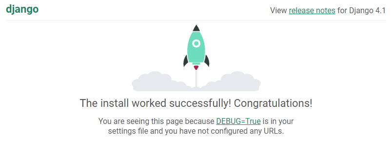

# Django on HelioHost

## Django on the Tommy and Johnny servers uses Python 3.10. 

 
If you need to run Django on another version of Python, you'll need to get a [VPS](https://heliohost.org/vps/).


## About Django

Django is a web development framework designed specifically for Python. As Ruby on Rails does for Ruby, Django aims to provide an MVC (Model-View-Controller) architecture for web application development as well as a large set of prebuilt libraries to simplify the development of common web app features. Django's modularity also allows easy scalability and enables the reuse of various code blocks, aligning to the DRY ("Don't Repeat Yourself") software development principle.

## Details

| Server | Django Version | Python Version | Python Path         | Loader | Python Modules Installed                                 |
| :----: | :------------: | :------------: | :-----------------: | :----: | :------------------------------------------------------: |
| Tommy  | 4.1.1          | 3.10           | /usr/bin/python3.10 | WSGI   | [View](https://krydos.heliohost.org/pyinfo/info3.10.py)  |
| Johnny | 4.1.5          | 3.10           | /usr/bin/python3.10 | WSGI   | [View](https://krydos2.heliohost.org/pyinfo/info3.10.py) |

## Enabled

### WSGI

Using the WSGI loader for a shared hosting environment is ideal because it conserves memory and enhances security.


Django changes can take **up to 2 hours** to appear consistently on your site because [WSGI uses server side caching](#wsgi-uses-server-side-caching).

If you want site changes to take effect immediately, we offer a few [options to work around caching](#options-to-work-around-caching).


### Complete Django

We offer the complete, unadulterated Django package, including extensions to interface with [MySQL](../management/mysql.md), [PostgreSQL](../features/postgresql.md), and [SQLite](../features/sqlite.md) database engines.

### Additional Libraries

To request additional libraries, please raise a request in the [Customer Service forum](https://helionet.org/index/forum/45-customer-service/?do=add), making sure to provide your **username**, your **server**, and **the libraries you need** including any relevant **version numbers** for them.

## Disabled

### Shell Access

We don't offer shell (command line) access to our users. Many Django tutorials and installation instructions assume that users have command line access, which may make working with Python & Django more difficult. Most people tend to develop on their home computer and then upload to their web server, which almost negates the need for this feature. Furthermore, most configuration done through the command line can be done through other methods, such as FTP and manual file editing.

### WSGI Daemon Mode

There are two ways to configure Django to work with the mod_wsgi loader in Apache. You can either create a separate daemon for each Django process (daemon mode) or embed Django into the Apache daemon (embedded mode). While daemon mode tends to be the standard among Django admins because of the increased control it offers, we use embedded mode because it can be set up on a per-user basis without very much root-level configuration. Embedded mode is slightly harder to get working (see directions below), and might break compatibility with some Django tutorials. In most cases, it should not be a problem.

## Getting started with Django 4.1 on HelioHost

This brief tutorial will guide you through setting up a Django test app without using the command line on your development system.

If you already have an existing Django app or prefer to use the command line, our tutorial on [Converting an Existing Django App](./converting-existing-django-app.md) may better suit your needs.

### 1. Create a directory on your main domain called `djangotest`. 

If you were transferred from the old cPanel, your main domain will be parked on the `public_html` directory.

If you created a new account on Plesk, your directory will be `httpdocs`.

### 2. Create an `.htaccess` file inside the `djangotest` directory with these contents:

```text
Options +ExecCGI
RewriteEngine On
RewriteBase /
RewriteRule ^(media/.*)$ - [L]
RewriteRule ^(admin_media/.*)$ - [L]
RewriteRule ^(djangotest/dispatch\.wsgi/.*)$ - [L]
RewriteRule ^(.*)$ djangotest/djangotest/dispatch.wsgi/$1 [QSA,PT,L]
```

### 3. Create another `djangotest` directory within the first `djangotest` directory

This directory structure is standard for a Django project. Please note that you cannot name the project folder `django`, it will not work. This is why the name `djangotest` is being used in this example.

### 4. Create a `dispatch.wsgi` file inside the second `djangotest` directory with these contents:

```text
import os, sys
# edit your path below
sys.path.append("/home/domain.helioho.st/httpdocs/djangotest")
from django.core.wsgi import get_wsgi_application
os.environ.setdefault('DJANGO_SETTINGS_MODULE', 'djangotest.settings')
application = get_wsgi_application()
```

Make sure you edit the path:

On Plesk, your path is `/home/domain.helioho.st/httpdocs/djangotest`.

If you were transferred from cPanel, your path is `/home/domain.helioho.st/public_html/djangotest`.

### 5. Create a `__init__.py` file inside the second `djangotest` directory

This file should remain empty.

### 6. Create a `urls.py` file inside the second `djangotest` directory with these contents:

```text
from django.contrib import admin
from django.urls import path
urlpatterns = [
#    path('admin/', admin.site.urls),
]
```

### 7. Create a `settings.py` file inside the second `djangotest` directory with these contents:

```text
from pathlib import Path
# Build paths inside the project like this: BASE_DIR / 'subdir'.
BASE_DIR = Path(__file__).resolve().parent.parent
# Quick-start development settings - unsuitable for production
# See https://docs.djangoproject.com/en/4.1/howto/deployment/checklist/
# SECURITY WARNING: keep the secret key used in production secret!
SECRET_KEY = 'django-makeyoursecretbetterthanthis'
# SECURITY WARNING: don't run with debug turned on in production!
DEBUG = True
ALLOWED_HOSTS = ['*']
# Application definition
INSTALLED_APPS = [
    'django.contrib.admin',
    'django.contrib.auth',
    'django.contrib.contenttypes',
    'django.contrib.sessions',
    'django.contrib.messages',
    'django.contrib.staticfiles',
]
MIDDLEWARE = [
    'django.middleware.security.SecurityMiddleware',
    'django.contrib.sessions.middleware.SessionMiddleware',
    'django.middleware.common.CommonMiddleware',
    'django.middleware.csrf.CsrfViewMiddleware',
    'django.contrib.auth.middleware.AuthenticationMiddleware',
    'django.contrib.messages.middleware.MessageMiddleware',
    'django.middleware.clickjacking.XFrameOptionsMiddleware',
]
ROOT_URLCONF = 'djangotest.urls'
TEMPLATES = [
    {
        'BACKEND': 'django.template.backends.django.DjangoTemplates',
        'DIRS': [],
        'APP_DIRS': True,
        'OPTIONS': {
            'context_processors': [
                'django.template.context_processors.debug',
                'django.template.context_processors.request',
                'django.contrib.auth.context_processors.auth',
                'django.contrib.messages.context_processors.messages',
            ],
        },
    },
]
WSGI_APPLICATION = 'djangotest.wsgi.application'
# Database
# https://docs.djangoproject.com/en/4.1/ref/settings/#databases
DATABASES = {
    'default': {
        'ENGINE': 'django.db.backends.sqlite3',
        'NAME': BASE_DIR / 'db.sqlite3',
    }
}
# Password validation
# https://docs.djangoproject.com/en/4.1/ref/settings/#auth-password-validators
AUTH_PASSWORD_VALIDATORS = [
    {
        'NAME': 'django.contrib.auth.password_validation.UserAttributeSimilarityValidator',
    },
    {
        'NAME': 'django.contrib.auth.password_validation.MinimumLengthValidator',
    },
    {
        'NAME': 'django.contrib.auth.password_validation.CommonPasswordValidator',
    },
    {
        'NAME': 'django.contrib.auth.password_validation.NumericPasswordValidator',
    },
]
# Internationalization
# https://docs.djangoproject.com/en/4.1/topics/i18n/
LANGUAGE_CODE = 'en-us'
TIME_ZONE = 'UTC'
USE_I18N = True
USE_TZ = True
# Static files (CSS, JavaScript, Images)
# https://docs.djangoproject.com/en/4.1/howto/static-files/
STATIC_URL = 'static/'
# Default primary key field type
# https://docs.djangoproject.com/en/4.1/ref/settings/#default-auto-field
DEFAULT_AUTO_FIELD = 'django.db.models.BigAutoField'
```

### 8. Make sure your directory structure and files look like this:

```text
djangotest/
├── djangotest
│   ├── dispatch.wsgi
│   ├── __init__.py
│   ├── settings.py
│   └── urls.py
└── .htaccess
1 directory, 5 files
```

### 9. Visit Your Site

In your web browser, navigate to `domain.helioho.st/djangotest`

If you did everything right it should look like this: 



## References

This tutorial is adapted from [this post](https://helionet.org/index/topic/53855-how-to-use-django-on-plesk/).