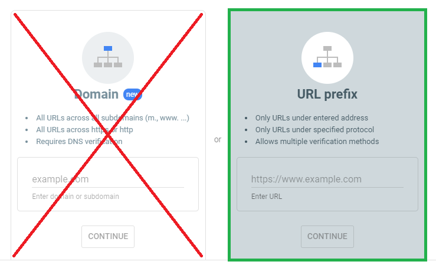
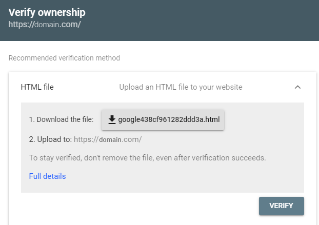

## Google Site Verification

Users can verify their own domains via [HTML file upload](https://support.google.com/webmasters/answer/9008080?hl=en#html_verification) without the need to contact an admin or use external DNS.

### 1. Login to Google Search Console

Go to Google Search Console at [https://search.google.com/search-console](https://search.google.com/search-console/), click on the `Start Now` button, and log in or create an account.

### 2. Select `URL prefix` Option

Select the `URL prefix` option, enter the URL for your site, and click on the `Continue` button.

### 3. Place the provided `HTML` file on your website

