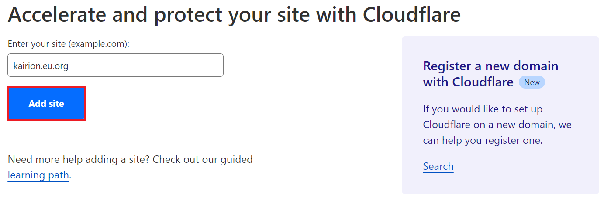
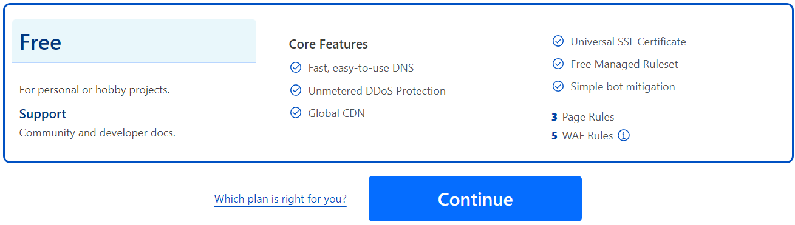
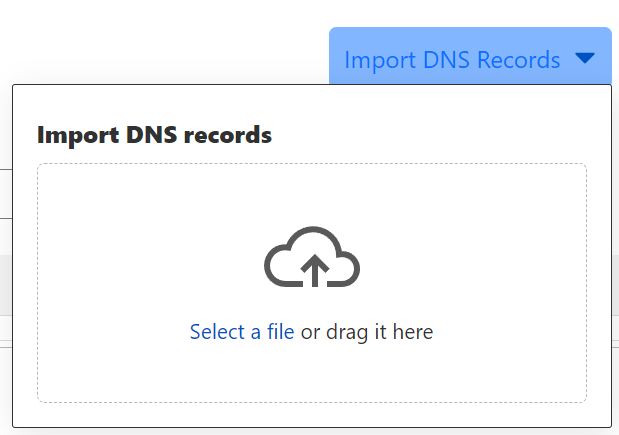
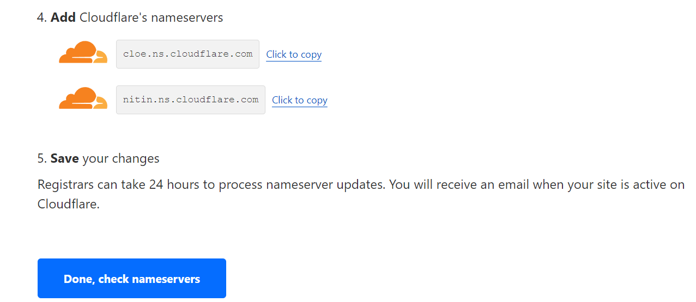

# Cloudflare

## Preface

This tutorial will guide you through the steps necessary to host your DNS on Cloudflare using their free service. You can follow this guide either when using our free hosting or when using a VPS.

## About Cloudflare

Cloudflare is a global CDN and also a DNS hosting service which has both free and paid plans.

## Create a Cloudflare account

For starters, you need to sign up to a Cloudflare. To do so, please follow [this link](https://dash.cloudflare.com/sign-up?pt=f) and create your free account.

## How to setup Cloudflare

Go to your [Cloudflare dashboard](https://dash.cloudflare.com/) and in the top of your screen click on Add site:

<figure><figcaption></figcaption></figure>

Next, insert your domain (without `www`) and click on Add site:

<figure><figcaption></figcaption></figure>

On the bottom of that page select Cloudflare's free plan and click on Continue:

<figure><figcaption></figcaption></figure>

Now, if you are already hosting your domain elsewhere, Cloudflare will automatically get and add your current DNS records and add them into their dashboard.

For your domain to work with HelioHost, you will need to delete the A and AAAA records pointing to your base domain, any records named "www" and also any text records mentioning SPF, DKIM, and DMARC.

Now, you should save the below text block as a text file on your computer according to your HelioHost account's server.

For Tommy:


```dns-zone-file
;; 
;;  _   _      _ _       _   _           _
;; | | | |    | (_)     | | | |         | |
;; | |_| | ___| |_  ___ | |_| | ___  ___| |_
;; |  _  |/ _ \ | |/ _ \|  _  |/ _ \/ __| __|
;; | | | |  __/ | | (_) | | | | (_) \__ \ |_
;; \_| |_/\___|_|_|\___/\_| |_/\___/|___/\__|
;;
;;
;; Sample DNS records for Tommy server. Please check your IP addresses
;; on your Plesk panel and if needed replace them.
;;

;; A Records
yourdomain.com.	1	IN	A	65.19.141.77

;; AAAA Records
yourdomain.com.	1	IN	AAAA	2001:470:1:1ee::2002

;; CNAME Records
www.yourdomain.com.	1	IN	CNAME	yourdomain.com.

;; MX Records
yourdomain.com.	1	IN	MX	0 yourdomain.com.

;; TXT Records
yourdomain.com.	1	IN	TXT	"v=spf1 ip4:65.19.141.77 ip6:2001:470:1:1ee::2002 ~all"
_dmarc.yourdomain.com.	1	IN	TXT	"v=DMARC1; p=none"
```


For Johnny:


```dns-zone-file
;; 
;;  _   _      _ _       _   _           _
;; | | | |    | (_)     | | | |         | |
;; | |_| | ___| |_  ___ | |_| | ___  ___| |_
;; |  _  |/ _ \ | |/ _ \|  _  |/ _ \/ __| __|
;; | | | |  __/ | | (_) | | | | (_) \__ \ |_
;; \_| |_/\___|_|_|\___/\_| |_/\___/|___/\__|
;;
;;
;; Sample DNS records for Johnny server. Please check your IP addresses
;; on your Plesk panel and if needed replace them.
;;

;; A Records
yourdomain.com.	1	IN	A	65.19.141.67

;; AAAA Records
yourdomain.com.	1	IN	AAAA	2001:470:1:1ee::2009

;; CNAME Records
www.yourdomain.com.	1	IN	CNAME	yourdomain.com.

;; MX Records
yourdomain.com.	1	IN	MX	0 yourdomain.com.

;; TXT Records
yourdomain.com.	1	IN	TXT	"v=spf1 ip4:65.19.141.67 ip6:2001:470:1:1ee::2009 ~all"
_dmarc.yourdomain.com.	1	IN	TXT	"v=DMARC1; p=none"
```


Make sure to replace on your text file "yourdomain.com" with your actual domain without changing anything else, as this could break the DNS zone file.

Now on your Cloudflare's dashboard click on "Import DNS Records" and then select the text file you saved on the previous step.

<figure><figcaption></figcaption></figure>

Finally, Cloudflare will show your nameservers. Simply copy and add both of them to your domain's nameservers setting at your domain registrar's dashboard/panel. When you are done, click on "Done, check nameservers" at Cloudflare's dashboard.

<figure><figcaption></figcaption></figure>

Please note that this last step may change according to your domain registrar, so please find how to do set nameservers for your domain at your domain registrar's support site or with their customer support.
