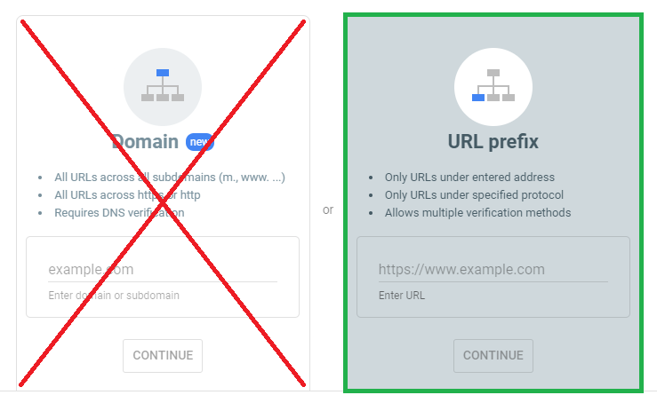
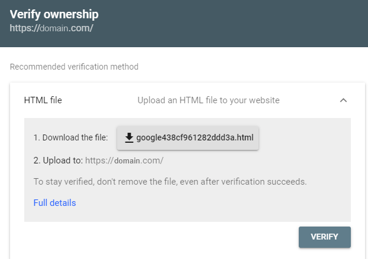

## Google Site Verification

Users can verify their own domains via [HTML verification](https://support.google.com/webmasters/answer/9008080?hl=en#html_verification) without the need to contact an admin or use external DNS.

### 1. Go to `search.google.com`

Go to [https://search.google.com](https://search.google.com/) and login or sign up. 

### 2. Click `add property` 

Click `add property` and when you select property type select `URL Prefix` and NOT `Domain`. 

### 3. Place the provided `HTML` file on your website

