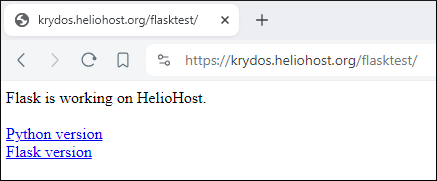

# Flask

### Flask on the Tommy and Johnny servers uses Python 3.10. 

 
If you need to run Flask on another version of Python, you'll need to get a [VPS](https://heliohost.org/vps/).


## About Flask

Flask is a Python web framework built with a small core and easy-to-extend philosophy.  
Read more at [Full Stack Python](https://www.fullstackpython.com/flask.html).

## How To Setup Flask on Plesk

### 1. Create a directory on your main domain called `flasktest`.  

If you were transferred from the old cPanel, your main domain will be parked on the `public_html` directory.  

If you created a new account on Plesk, your directory will be `httpdocs`.

### 2. Create an `.htaccess` file inside the `flasktest` directory with these contents:

```text
Options +ExecCGI
RewriteEngine On
RewriteBase /
RewriteRule ^(media/.*)$ - [L]
RewriteRule ^(admin_media/.*)$ - [L]
RewriteRule ^(flask\.wsgi/.*)$ - [L]
RewriteRule ^(.*)$ flasktest/flask.wsgi/$1 [QSA,PT,L]
```

### 3. Create a file named `flask.wsgi` inside the `flasktest` directory with these contents:

```text
import os, sys

# edit your path below
sys.path.append("/home/domain.helioho.st/httpdocs/flasktest");

sys.path.insert(0, os.path.dirname(__file__))
from myapp import app as application

# set this to something harder to guess
application.secret_key = 'secret'
```

### 4. Create a file named `myapp.py` inside the `flasktest` directory with these contents:

```text
import sys

from flask import Flask, __version__
app = Flask(__name__)
application = app

@app.route("/")
def hello():
  return """

    Flask is working on HelioHost.<br><br>
    <a href="/flasktest/python/version/">Python version</a><br>
    <a href="/flasktest/flask/version/">Flask version</a>

  """

@app.route("/python/version/")
def p_version():
  return "Python version %s<br><br><a href='/flasktest/'>back</a>" % sys.version

@app.route("/flask/version/")
def f_version():
  return "Flask version %s<br><br><a href='/flasktest/'>back</a>" % __version__

if __name__ == "__main__":
  app.run()
```

### 5. Make sure your directory structure and files look like this:

```text
flasktest/
├── flask.wsgi
├── .htaccess
└── myapp.py

0 directories, 3 files
```

### 6. If you did everything right it should look like the below:

Screenshot taken from [https://krydos.heliohost.org/flasktest/](https://krydos.heliohost.org/flasktest/)



## WSGI Uses Caching


Flask changes can take **up to 2 hours** to appear consistently on your site because WSGI uses server side caching.

If you want site changes to take effect immediately, please refer to the options below.


### What Caching Does

Multiple Apache processes are running on the server, and each time you refresh your site you are randomly assigned to one of these processes. If that particular process has already displayed your site, it shows the cached version of your code; otherwise, it shows the new code changes. This means that during the first 2 hours after a site change, you may intermittently see old or new content, depending on which process you get assigned to. This situation will resolve when Apache is restarted, which happens every 2 hours.

## Options to Work Around Caching

### 1. Request WSGI Control Access

A new feature currently in beta is the ability for users to restart their Flask app themselves. 

To request this, please create a new post in the [Customer Service forum](https://helionet.org/index/forum/45-customer-service/?do=add) and provide your **username**, **server name**, and the **domain name(s)** you want to be given WSGI Control Access for. (If you have 2 Flask apps on 2 different domains, you need to request WSGI Control Access for each domain.)

Once you have been given WSGI Control Access, you can edit your `flask.wsgi` to reload your Flask app so new code changes load immediately. The edits to the file can be as simple as adding or removing a space or a blank line. As long as the file's `last modified date` changes it will discard the cache and reload your Flask app.

Please let us know if you experience unexpected results with this new feature.

#### Account Resets Remove WSGI Control Access


If you [request an account reset](../faq.md#how-do-i-reset-my-hosting-account-to-start-fresh) and want WSGI Control Access re-enabled after the reset, please specify this in your reset request. By default, account resets will disable WSGI Control Access.


### 2. Use Local Development Environment

Another option to see code changes reflected immediately is to develop your Flask app on your home computer and then host the production copy on the server.

### 3. VPS

You may prefer to explore one of our paid [VPS Plan](https://heliohost.org/vps/) options, depending on your requirements.

## Troubleshooting

If you receive an error of `You don't have permission to access /flasktest/flask.wsgi/ on this server`, you may need to add `AddHandler cgi-script .py` on a new line in your `.htaccess` file.

## Running Flask at the Webroot

The above example is for Flask in a subdirectory, so users can host different projects in different subdirectories rather than dedicating the whole domain to one Flask app.

If you prefer to run Flask at the webroot instead, this is possible with some slight changes to the `.htaccess`, `flask.wsgi`, and `myapp.py` files.

### References

This tutorial is adapted from the **[How to Use Flask on Plesk](https://helionet.org/index/topic/53856-how-to-use-flask-on-plesk/)** post on the HelioNet forum, answered by Krydos.