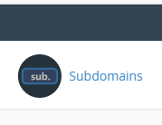
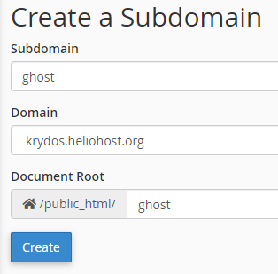
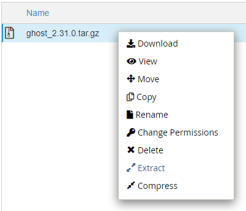
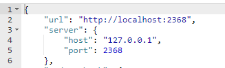
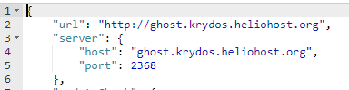
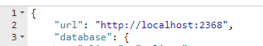
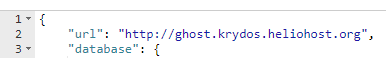
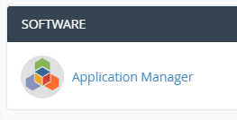
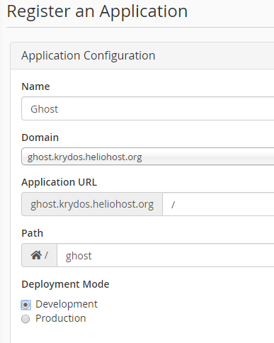

# Ghost CMS

## Preface

Ghost requires Node.js which is only available on the Tommy server currently.

## About Ghost

Ghost is a free and open source blogging platform written in JavaScript and distributed under the MIT License, designed to simplify the process of online publishing for individual bloggers as well as online publications. Independent tests have found Ghost to be up to 1,900% faster than WordPress. What does that mean? In the amount of time it takes WordPress to respond to 1 request, Ghost will have already responded to 19 of them. The speed of your blog impacts everything, from search engine rankings to mobile user engagement.

## How to setup Ghost

Ghost doesn't like being in a subdirectory so `domain.com/ghost/` won't work right. We will create a subdomain for it. Log in to cPanel and click the `Subdomains`button.



Let's create a subdomain called `ghost`.



Next, open the File Manager.


Create a new directory in your home folder named `ghost`. Make sure this ghost directory is **NOT** in your `public_html` folder.

```text
/home/username/ghost
```

Download the ghost files from [https://krydos.heliohost.org/ghost/ghost\_2.31.0.tar.gz](https://krydos.heliohost.org/ghost/ghost_2.31.0.tar.gz)

Upload the ghost archive to the ghost directory you just created.

```text
/home/username/ghost/ghost_2.31.0.tar.gz
```

Use file manager to extract the archive by right clicking on the file and selecting `Extract`.



Now we need to configure ghost. In the file manager navigate to:

```text
/home/username/ghost/core/server/config/
```

and edit the `defaults.json` file.



On the URL line where it says `localhost:2368` change that to your subdomain that you created on the first step `ghost.domain.heliohost.org`. Make sure you leave off the port. Then on the host line where it says `127.0.0.1` change that to your subdomain too, but without the http this time so `ghost.domain.heliohost.org`. It looks more like:



Next, navigate to:

```text
/home/username/ghost/core/server/config/env/
```

and edit the `config.development.json` file.



Once again we're going to change the URL from `localhost:2368` to `ghost.domain.heliohost.org` like so.



Now we need to register the node application in cPanel so open the [Application Manager](https://tommy.heliohost.org:2083/frontend/paper_lantern/passenger/index.html).



Click `+ Register Application`.


For name enter `Ghost`, domain select the subdomain that you created at the beginning of this guide, application URL just leave with the default `/` with nothing after it, path enter `ghost`, and deployment mode select `Development` so it looks something like this:



Then click deploy. In order for the Node.js application to be deployed it requires an Apache restart so this could take anywhere from a few minutes to a few hours. If it's been more than 2 hours and it still isn't working please open [a customer service ticket](https://www.helionet.org/index/forum/45-customer-service/) and let us know.

Once the ghost application has been deployed you should be able to go to `ghost.domain.heliohost.org` and see the CMS in action, and if you want to create new articles and access the backend go to `ghost.domain.heliohost.org/ghost/`.

