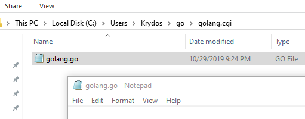
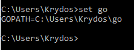
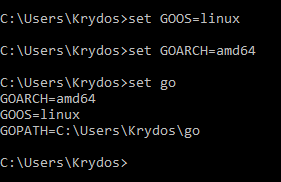
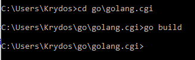
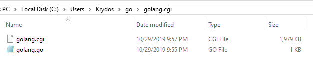
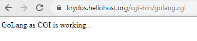

# Golang as CGI

## Preface

This guide will work on any of the HelioHost servers.

The Go programming language, often called Golang, is an open source project to make programmers more productive. Go is expressive, concise, clean, and efficient. Its concurrency mechanisms make it easy to write programs that get the most out of multi-core and networked machines, while its novel type system enables flexible and modular program construction. Go compiles quickly to machine code yet has the convenience of garbage collection and the power of run-time reflection. It's a fast, statically typed, compiled language that feels like a dynamically typed, interpreted language.

## How to get Started with Go

Go is a compiled language so you'll need to build the code on your development system, and then upload the executable. For this example we will be using Windows 10 for development. In order to build the Go language you'll need to install the compiler. Go to

[https://golang.org/dl/](https://golang.org/dl/) to download and install the version for your OS.

### Create the Source File on the Development System

Create a directory for the Go source. In this example we used:

```text
C:\Users\Krydos\go\golang.cgi\
```

In that directory, create a new file named `golang.go` and open it in Notepad.



Copy and paste this code into the Notepad window:

```text
package main

import "fmt"

func main() {
  fmt.Printf("Content-type: text/html\n\n")
  fmt.Printf("GoLang as CGI is working...")
}
```

and save Notepad.

### Set the Environment Variables

By default Go will build the executable to run on your local system, which is Windows. We want to run the executable on HelioHost's server so we need to tell the compiler to make an executable that will work on Linux. Open a new command prompt, and run the command

```text
set go
```

This will output all of your environment variables that start with `go`. There should be just one, your `GOPATH`.



You can set new environment variables using that same set command. Type these two commands:

```text
set GOOS=linux
set GOARCH=amd64
```

and then run `set go` again to check that they saved correctly.



If you close this command window and open a new one those environment variables will be gone and you'll need to set them again so get in the habit of checking the `set go` command output.

### Build the Executable

In the same command prompt window that you set the environment variables change directory to your source file that you created earlier.

```text
cd go\golang.cgi
```

and then run the command:

```text
go build
```

**Note:** If the `go build` command does not work, you may need to use `go build golang.go` instead.



If everything goes well you should now have an executable named `golang.cgi`.



### Upload the Executable and Set Permissions

Log in to cPanel and open the File Manager.


Navigate to the `public_html/cgi-bin` directory, and click `Upload`. Locate the `golang.cgi` file on your hard drive and upload it. When the upload bar turns green close that windows, and go back to the File Manager. Click `Reload`, and you should see the file you uploaded. Right click on `golang.cgi` and select `Change Permissions`.


Check the 3 execute boxes to set the permissions to `755` to make the file executable.


### Test the Golang CGI

Now just open the file in your browser by going to `domain.heliohost.org/cgi-bin/golang.cgi`. If everything is working you should see the message.



If it doesn't work go back and check all of your steps again. If you can't figure out what is wrong let us know by opening [a customer service ticket](https://www.helionet.org/index/forum/45-customer-service/). We'd be happy to help.

