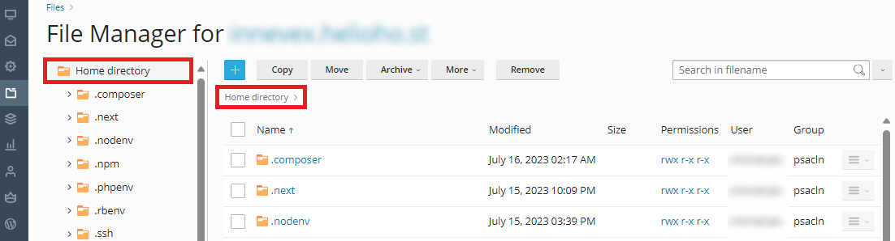
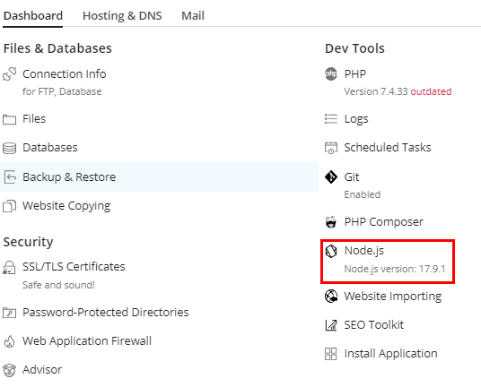
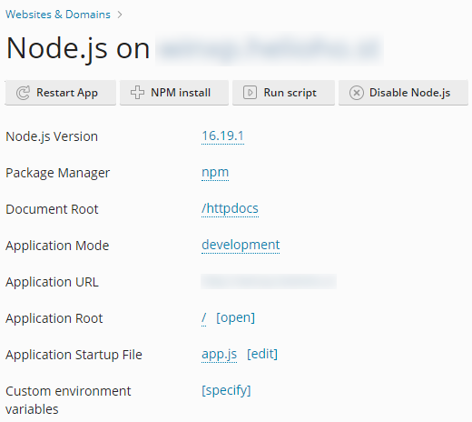
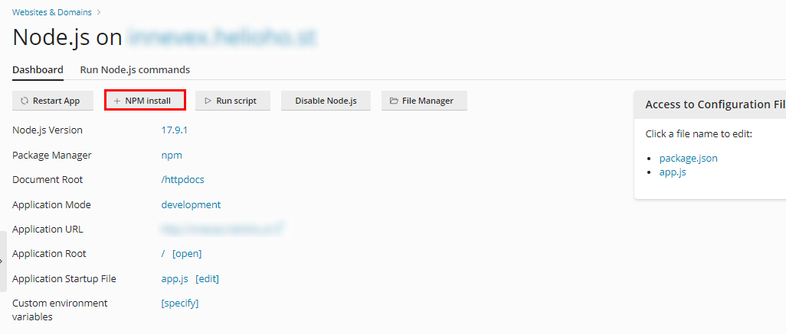
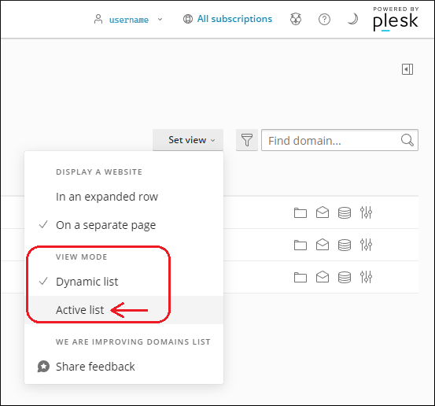

# Node.js

## Supported Versions

| Server | Node.js Version                                     |
|--------|-----------------------------------------------------|
| Tommy  | 8.17.0, 10.24.1, 12.22.12, 14.21.3, 16.19.1, 17.9.1 |
| Johnny | 22.8.0, 21.7.3, 20.17.0, 18.20.4, 16.20.2           |

## About Node.js

As an asynchronous event-driven JavaScript runtime, Node.js is designed to build scalable network applications. In 
Node.js applications, many connections can be handled concurrently. Upon each connection, the callback is fired, but if
there is no work to be done, Node.js will sleep.

This is in contrast to today's more common concurrency model, in which OS threads are employed. Thread-based networking
is relatively inefficient and very difficult to use. Furthermore, users of Node.js are free from worries of dead-locking
the process, since there are no locks. Almost no function in Node.js directly performs I/O, so the process never blocks.
Because nothing blocks, scalable systems are very reasonable to develop in Node.js.

## How to setup Node.js

Your Node.js files will go into your user directory (NOT `httpdocs`).



In that folder create an `app.js` file:

```javascript
const http = require('http');
const hostname = '127.0.0.1';
const port = 3000;

const server = http.createServer((req, res) => {
  res.statusCode = 200;
  res.setHeader('Content-Type', 'text/html');
  res.end('Node.js is working.');
});

server.listen(port, hostname, () => {
  console.log(`Server running at http://${hostname}:${port}/`);
});
```

In Plesk, go to "Website & Domains".


Under the domain you'd like to use for Node.js, select `Node.js`.


If you do not see `Node.js` listed, you may need to [Change View in Plesk](#change-view-in-plesk)




Here, you're able to configure settings for your application.



You don't need to worry about environment variables on this simple example. Select `app.js` for your startup file. If you have any NPM packages, Plesk can install them for you.



In order for the Node.js application to be deployed, it requires an Apache restart. Apache is restarted every 2 hours, so you may need to wait anywhere from a few
minutes to up to 2 hours maximum. If it's been more than 2 hours, and the Node.js application still isn't working, please submit a request **containing your hosting account username** in the [Customer Support forum](https://helionet.org/index/forum/45-customer-service/?do=add).

Once the Node.js application has been deployed you should be able to go to `domain.heliohost.org` and see the
text `Node.js is working.`.

### Change View in Plesk {#change-view-in-plesk}

If you do not see `Node.js` listed under the domain you'd like to use, you will need to change your Plesk dashboard View settings. To do this, go to "Website & Domains", select "Set View", scroll down to "View Mode", and change the selected view. Now, you should be able to find `Node.js` listed.


