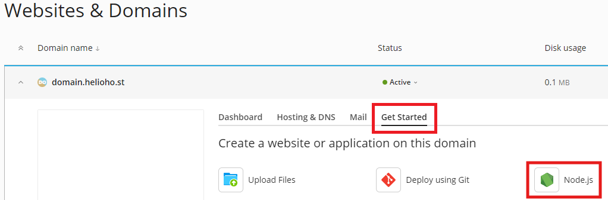

# Node.js


If you use Node.js, we strongly recommend that you [monitor your site load here](https://heliohost.org/dashboard/load/).

Node apps often require a lot of server resources, and exceeding the account load limits will cause your user account to be [suspended for high server usage](/accounts/suspension-policy.md#high-server-usage).


## Node.js Versions Supported

The Node.js versions currently supported on the shared hosting servers are listed below. While we aim to keep Node versions current, please make sure you review our [ETAs for New Features](../../hosting/repair-times.md).

 
If you require a different version of Node.js than the options offered below, you'll need to get a [VPS](https://heliohost.org/vps/) where you can install any version(s) of Node you want. We offer a range of VPS plans, and a 10% discount when you pay for 6 months upfront.


### Johnny server

* Node 16
* Node 18
* Node 20
* Node 21
* Node 22
* Node 23

# Tommy server
* Node 16
* Node 18
* Node 20
* Node 21
* Node 22
* Node 23

# Morty server
* Node 16
* Node 18
* Node 20
* Node 21
* Node 22
* Node 23

## About Node.js

As an asynchronous event-driven JavaScript runtime, Node.js is designed to build scalable network applications. In Node.js applications, many connections can be handled concurrently. Upon each connection, the callback is fired, but if there is no work to be done, Node.js will sleep.

This is in contrast to today's more common concurrency model, in which OS threads are employed. Thread-based networking is relatively inefficient and very difficult to use. Furthermore, users of Node.js are free from worries of dead-locking the process, since there are no locks. Almost no function in Node.js directly performs I/O, so the process never blocks. Because nothing blocks, scalable systems are very reasonable to develop in Node.js.

## Node.js on Plesk Uses Passenger

### What is Passenger?

Passenger is a way of running Node.js, Ruby on Rails (RoR), and other applications that normally require a constantly running background process. Instead of the process always running in the background just waiting for connections, Passenger shuts it down if there are no connections. When someone visits the website, Passenger fires up the Node.js (or Ruby, or whatever language you're using) process. If another person visits the website while the Node.js process is still running, page loads will be very fast. If there are no further page hits for 5 minutes or so, Passenger kills the background process.

### Why Does HelioHost Use Passenger?

It doesn't make sense to leave your car running 24/7 in front of your house just in case you need to drive somewhere so it saves you a second to start the engine. This is a massive waste of gas. Likewise, it doesn't make sense to leave Node.js sites running 24/7 just to save a second of load time in case someone needs to view the page. This is a massive waste of memory. At HelioHost, we want to ensure that the server memory is used efficiently so our servers work efficiently for the hundreds of users on our shared hosting platform.

### Will Passenger Slow My Site Down?

A recent speed test on HelioHost servers showed that our app [only took 177ms to load from a cold start](https://gtmetrix.com/reports/node.krydos1.heliohost.org/esvkM1p0/). That's just under 1/5 of a second, roughly the amount of time it takes to blink.

### How Can I Use Passenger?

By following the steps in this tutorial, Plesk will automatically use Passenger to run your Node.js application.

### Can I Change the Inactivity Timeout?

No, the background process timeout is set to ensure fair resource usage for all our users and cannot be changed. If you need more control over memory management, HelioHost offers a range of [VPS plans](https://heliohost.org/vps/) where you can configure your settings, and a 10% discount when you pay for 6 months upfront.

### Can I Prevent My Site from Sleeping?

Passenger is designed to keep our shared hosting servers running efficiently and help keep your account within the [account load limits](../../accounts/suspension-policy.md#account-load-limits). Deliberately preventing your site from sleeping is likely to get your account suspended for [High Server Usage](../../accounts/suspension-policy.md#high-server-usage).

### What If My Users Cannot Wait For My Site To Load?

If your application is highly time-sensitive and every millisecond of load time matters, HelioHost offers a range of [VPS plans](https://heliohost.org/vps/) and a 10% discount when you pay for 6 months upfront. With a VPS, you won’t share your server with other users, so you can run any continuous process(es) that you want.

## How to setup Node.js

First, delete (or rename) the 'index.html' file that comes by default in the 'httpdocs' folder.

Your Node.js files will go into your home directory (**NOT** `httpdocs`):


In your home directory folder, create an `app.js` file with these contents:

```javascript
const http = require('http');
const hostname = '127.0.0.1';
const port = 3000;

const server = http.createServer((req, res) => {
  res.statusCode = 200;
  res.setHeader('Content-Type', 'text/html');
  res.end('Node.js is working.');
});

server.listen(port, hostname, () => {
  console.log(`Server running at http://${hostname}:${port}/`);
});
```

In Plesk, go to: `Website & Domains > [domain]` 



Here, you're able to configure settings for your application.


You don't need to worry about environment variables on this simple example. Select `app.js` for your startup file. If you have any NPM packages, Plesk can install them for you.


Finally, you will need to wait **up to 2 hours** for the server to update.


Node.js application deployment can take **up to 2 hours** to go into effect as it requires an Apache restart. After an entire 2 hours, if your Node app is not working for you, please [clear your web browser cache](../../misc/clear-your-cache.md).


Once the Node.js application has been deployed, you should be able to visit `domain.helioho.st` in your web browser and see the text `Node.js is working.`


## Further Support 

If it's been more than 2 hours, and the Node.js application still isn't working, please go back and check all of your steps again. If it's been more than a full 2 hours since your changes, and it still isn't working even after you [cleared your web browser cache](../misc/clear-your-cache.md), please make a new post in the [Customer Service forum](https://helionet.org/index/forum/45-customer-service/?do=add), making sure to provide your **username**, **domain**, and any **error message(s)** encountered.