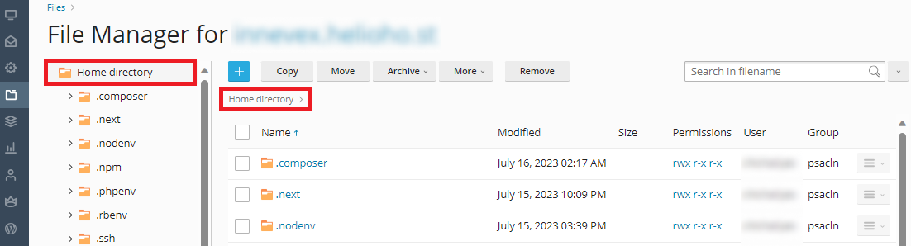

# Express.js


If you use Node.js, we strongly recommend that you [monitor your site load here](https://heliohost.org/dashboard/load/).

Node apps often require a lot of server resources, and exceeding the account load limits will cause your user account to be [suspended for high server usage](/accounts/suspension-policy.md#high-server-usage).


## About Express.js

Express.js is a web application framework for Node.js. It provides a set of tools and features to build web applications and APIs quickly and easily. Express.js simplifies common tasks like routing, handling HTTP requests and responses, setting up middleware, and managing sessions. It is lightweight and flexible, allowing developers to structure their applications as they see fit. It is commonly used for building RESTful APIs or server-side applications.

## Setup


If you prefer visual guidance, we have a [video tutorial](https://www.youtube.com/watch?v=Ak2yI8w-mew&ab_channel=HelioHost) available for you to watch.  
To follow the written instructions, please continue reading below.


Go into your project root. (If you don't have a project, you can use [this example project](https://github.com/HelioNetworks/Node.JS-Example).)

## How to Setup Express.js

Your Node.js files will go into your user directory (**NOT** `httpdocs`):



### Note: Delete the content inside `httpdocs`

If you're not using the above example, then create a new file `app.js` and put this inside:

```javascript
const http = require('http');
const express = require('express');
const port = 3000;

const app = express();

app.get('/', (req, res) => {
  res.status(200).send('Node.js is working with Express and http.');
});

// Create an HTTP server using the Express app
const server = http.createServer(app);

server.listen(port, () => {
  console.log(`Server running`);
});
```

Create a new file `package.json` and put this inside:

```javascript
{
  "name": "node-test",
  "version": "0.0.0",
  "private": true,
  "scripts": {
    "start": "node app.js"
  },
  "dependencies": {
    "cookie-parser": "~1.4.4",
    "debug": "~2.6.9",
    "express": "~4.16.1",
    "http-errors": "~1.6.3",
    "morgan": "~1.9.1",
    "pug": "^3.0.2"
  }
}
```

In Plesk, go to: `Website & Domains > [domain]` 


## Server Setup

Upload all your files to your server. Then go to the Node.js section and set the following:  

* Node.js Version: we recommend using [the latest available](README.md#supported-versions).
* Application Root: `/` (This is the folder where you uploaded your project.)
* Application Startup File: `app.js` (The entry point of our app, use the file we created earlier.)
* Here, you're able to configure settings for your application.


## Starting the Server

Once all of the above steps are done, press the `Enable Node.js` button.


Then you need to run the `NPM install` command.


Finally, you will need to wait **up to 2 hours** for the server to update.


Node.js application deployment can take **up to 2 hours** to go into effect as it requires an Apache restart. After an entire 2 hours, if your Node app is not working for you, please [clear your web browser cache](../../misc/clear-your-cache.md).


Once the Node.js application has been deployed, you should be able to visit `domain.helioho.st` in your web browser and see the text `Node.js is working.`


## Further Support 

If it's been more than 2 hours, and the Node.js application still isn't working, please go back and check all of your steps again. If it's been more than a full 2 hours since your changes, and it still isn't working even after you [cleared your web browser cache](../misc/clear-your-cache.md), please make a new post in the [Customer Service forum](https://helionet.org/index/forum/45-customer-service/?do=add), making sure to provide your **username**, **domain**, and any **error message(s)** encountered.