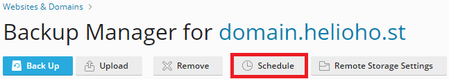

# Plesk Account Backups

## Where to Download Your Account Backup

If the HelioHost team made a backup of your hosting account data, you can retrieve it by visiting [https://heliohost.org/backup](https://heliohost.org/backup/) and following the instructions on the page to download the file.

Inside the downloaded backup file, there will be a large file named `backup_user-data_##########.tzst` which contains all your files.  

The file will be in a format called `Z-standard` and will need to be extracted.

## How to Extract Your Account Data from the Backup File

### Linux or Mac

On Linux or Mac you can install the `zstd` package and extract it on the command line. 

### Access Your Files in Ubuntu v22+

* Navigate to the directory containing your backup file named `pleskbackup-YourAccountUsername.tar`
* Install the `zstd` package with the `sudo apt install zstd` command 
* Untar the downloaded file with the `tar -xvf pleskbackup-YourAccountUsername.tar` command
* You should see a list of filenames similar to the below: 
```text
domains/YourAccountUsername.helioho.st/backup_user-data_##########.tzst <--- Your account data
domains/YourAccountUsername.helioho.st/backup_apache-files_##########.tzst
domains/YourAccountUsername.helioho.st/backup_pd_##########.tzst
domains/YourAccountUsername.helioho.st/backup_conf_##########.tzst
domains/YourAccountUsername.helioho.st/backup_logs_##########.tzst
domains/YourAccountUsername.helioho.st/backup_statistics_##########.tzst
domains/YourAccountUsername.helioho.st/backup_domainmail_##########.tzst
backup_action-log_##########.tzst
domains/YourAccountUsername.helioho.st/.discovered/backup_info_##########/props
domains/YourAccountUsername.helioho.st/.discovered/backup_info_##########/cid_user-data
domains/YourAccountUsername.helioho.st/.discovered/backup_info_##########/cid_apache-files
domains/YourAccountUsername.helioho.st/.discovered/backup_info_##########/cid_domainmail_472
domains/YourAccountUsername.helioho.st/.discovered/backup_info_##########/status_OK
domains/YourAccountUsername.helioho.st/.discovered/backup_info_##########/object_index
domains/YourAccountUsername.helioho.st/backup_info_##########.xml
.discovered/backup_info_##########/props
.discovered/backup_info_##########/status_OK
.discovered/backup_info_##########/dumpresult_SUCCESS
.discovered/backup_info_##########/object_index
.discovered/backup_info_##########/webcontent_index
backup_info_##########.xml
dump-header
dump-index
archive-index
```
* There will be several `.tzst` files inside that you can extract using the `unzstd` command
* Your account data is located at `domains/YourAccountUsername.helioho.st/backup_user-data_##########.tzst`
* Navigate to the `domains` directory
* Navigate to the `YourAccountUsername.helioho.st` directory
* Extract your data from the `backup_user-data_##########.tzst` file with the `unzstd backup_user-data_##########.tzst` command 
* Your data will then be extracted to a `.tar` file called `backup_user-data_##########.tar`
* Untar the file with the `tar -xvf backup_user-data_2408272149.tar` command
* You should see a list of your site files and directories. For example: 
```text
httpdocs/
httpdocs/cgi-bin/
httpdocs/index.html
...
```

### Windows 

On Windows you can use [WinRar v6+](https://www.win-rar.com/) or [7-Zip v24+](https://www.7-zip.org/).

### Access Your Files

* Navigate to the main backup file named `pleskbackup-YourAccountUsername.tar`
* Extract the `.tar` file using one of the software packages listed above
* The files will be extracted to a folder named `pleskbackup-YourAccountUsername`
* Open the folder and navigate to the `domains` folder
* Open the next folder, named `YourAccountUsername.heliohost.us` or `YourAccountUsername.helioho.st`
* Navigate to the file named `backup_user-data_##########.tzst` 
* Open the file to access your data


## Making Your Own Manual Account Backup

As mentioned in our [Terms of Service](../../hosting/terms.md), it is not HelioHost's responsibility to keep backups of your data. We strongly recommend you backup your data regularly and keep it in a safe place.


Backups created through Plesk count towards your [1000 MB account storage limit](../../features/storage.md). To avoid [account suspension](../../accounts/suspension-policy.md) for exceeding your disk quota, we recommend regularly downloading and deleting older backups.

If you need more space, you can [donate to increase your account storage](../../accounts/donation-increase-storage.md) from 1000 MB up to a maximum of 6000 MB total. For even more storage, we offer [VPS Plans](https://heliohost.org/vps/) with space ranging from 50 GB to 300 GB.


Follow the navigation steps below to make a backup of your hosting account inside Plesk:

#### Login > Plesk > Websites & Domains > [ domain ] > Backup & Restore


Click the `Back Up` button:


Select the account content you want to back up, and click on the `OK` button:


## Downloading a Local Copy of Your Backup

Once the backup process finishes, click on the green arrow icon to download the backup file to your local computer:


Make your selection about using a password to encrypt users' passwords contained in the Plesk database or not, and click on the `OK` button:


Your backup file will be downloaded to your local machine with filename `backup_domain.helioho.st_##########.tar`

## Scheduling Automated Account Backups

Follow the navigation steps below to set up or modify scheduled account backup settings inside Plesk:

#### Login > Plesk > Websites & Domains > [ domain ] > Backup & Restore > Schedule



After clicking the `Schedule` button, adjust the settings as needed.

Backup files count towards your [1000 MB account storage limit](../../features/storage.md), so we recommend filling in the `Maximum number of full backup files to store` field to a number that makes sense for the total filesize of your account. Otherwise if you leave this field blank, backup files will pile up and increase your file storage unnecessarily, leaving you at risk of [account suspension](../../accounts/suspension-policy.md) for exceeding your disk quota.

If you need more space, you can [donate to increase your account storage](../../accounts/donation-increase-storage.md) from 1000 MB up to a maximum of 6000 MB total. For even more storage, we offer [VPS Plans](https://heliohost.org/vps/) with space ranging from 50 GB to 300 GB.


## Further Support

If after following the above steps, you are unable to download or extract your backup data or make your own account backup, please post a topic in the [Customer Support forum](https://helionet.org/index/forum/45-customer-service/?do=add). Please make sure you provide your hosting account **username** and details of the problem, including what steps you have tried, and any **error message(s)** encountered.

### References

Sections of this tutorial have been adapted from posts about [extracting Plesk backup files](https://helionet.org/index/topic/58777-solved-suspended-account/#comment-260423) and [repairing a damaged backup file](https://helionet.org/index/topic/61744-solved-unable-to-restore-backup-in-plesk/#comment-275392) on the HelioNet forum.