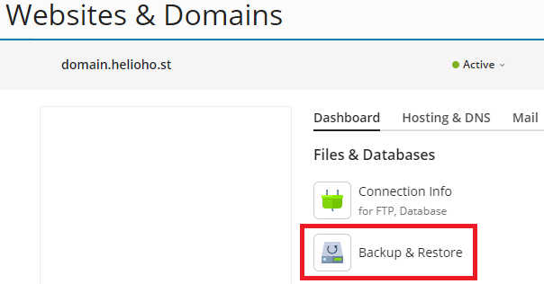

# Plesk Account Backups

## Where to Download Your Account Backup

If the HelioHost team made a backup of your hosting account data, you can retrieve it by visiting [https://heliohost.org/backup](https://heliohost.org/backup/) and following the instructions on the page to download the file.

Inside the downloaded backup file, there will be a large file named `backup_user-data_##########.tzst` which contains all your files.  

The file will be in a format called `Z-standard` and will need to be extracted.

## How to Extract Your Account Data from the Backup File

### Linux or Mac

On Linux or Mac you can install the `zstd` package and extract it on the command line. 

### Windows 

On Windows you can use [WinRar v6+](https://www.win-rar.com/) or [7-Zip v24+](https://www.7-zip.org/).

## Access Your Files

* Navigate to the main backup file named `pleskbackup-YourAccountUsername.tar`
* Extract the `.tar` file using one of the software packages listed above
* The files will be extracted to a folder named `pleskbackup-YourAccountUsername`
* Open the folder and navigate to the `domains` folder
* Open the next folder, named `YourAccountUsername.heliohost.us` or `YourAccountUsername.helioho.st`
* Navigate to the file named `backup_user-data_##########.tzst` 
* Open the file to access your data

## Making Your Own Manual Account Backup

As mentioned in our [Terms of Service](../../hosting/terms.md), it is not HelioHost's responsibility to keep backups of your data. We strongly recommend you backup your data regularly and keep it in a safe place.

Follow the navigation steps below to make a backup of your hosting account inside Plesk:

#### Login > Plesk > Websites & Domains > [ domain ] > Backup & Restore

Click the `Back Up` button:

Select the account content you want to back up, and click on the `OK` button:

## Downloading a Local Copy of Your Backup

Once the backup process finishes, click on the green arrow icon to download the backup file to your local computer:

Make your selection about using a password to encrypt users' passwords contained in the Plesk database or not, and click on the `OK` button:

Your backup file will be downloaded to your local machine with filename `backup_domain.helioho.st_##########.tar`

## Scheduling Automated Account Backups

Follow the navigation steps below to set up or modify scheduled account backup settings inside Plesk:

#### Login > Plesk > Websites & Domains > [ domain ] > Backup & Restore > Schedule

After clicking the `Schedule` button, adjust the settings as needed.

Backup files count towards your [1000 MB account storage limit](../../features/storage.md), so we recommend filling in the `Maximum number of full backup files to store` field to a number that makes sense for the total filesize of your account. Otherwise if you leave this field blank, backup files will pile up and increase your file storage unnecessarily, leaving you at risk of [account suspension](../../accounts/suspension-policy.md) for exceeding your disk quota.

## Further Support

If after following the above steps, you are unable to download or extract your backup data or make your own account backup, please post a topic in the [Customer Support forum](https://helionet.org/index/forum/45-customer-service/?do=add). Please make sure you provide your hosting account **username** and details of the problem, including what steps you have tried, and any **error message(s)** encountered.

### References

The original discussion which prompted the creation of this tutorial for extracting Plesk backup files can be found [here](https://helionet.org/index/topic/58777-solved-suspended-account/#comment-260423).