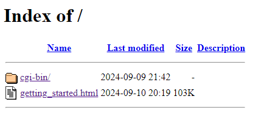
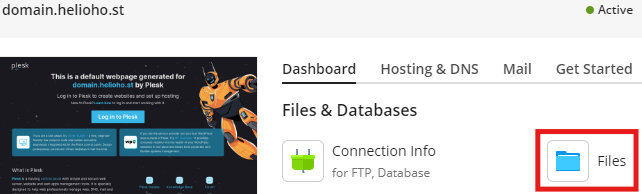
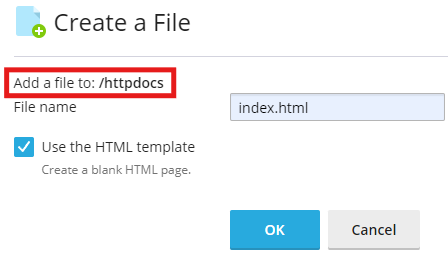
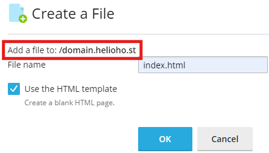
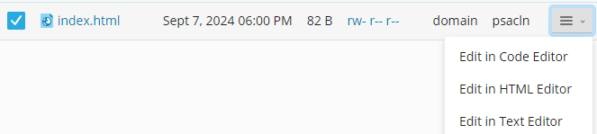
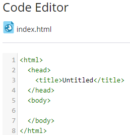
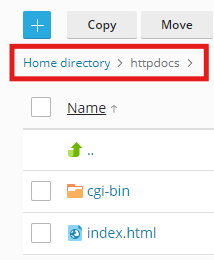
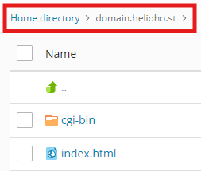

# Creating a Website

## Directory Index

When a new account, domain, or subdomain is added on HelioHost, the first time it's viewed in a browser, a list of files will appear, similar to the example below. This is called `directory indexing` or `directory listing`, and it's enabled by default because many users have requested this feature over the past few years. 


To prevent directory listings for any folder, simply place an empty `index.html` file inside it. This will display a blank page instead of a list of files when someone visits the directory's web address.




We recommend that you open the `getting_started.html` file in a web browser and follow the helpful links to software and tutorials that will help you get started building your site.

## Create a Basic Website

The below tutorial will walk you through setting up a basic website on HelioHost. The examples below show [Plesk](../../features/plesk.md)'s built-in File Manager, but you can accomplish the same result by [managing files using FTP](../../management/uploading-files.md) if you prefer. 

### Log in to Plesk

Follow the navigation steps below to access the File Manager inside Plesk: 

#### Login > Plesk > Websites & Domains > [ domain ] > Files




Do not bookmark your Plesk File Manager, as your visits are not recorded and you will be [suspended for inactivity](../../accounts/suspension-policy.md#inactivity-policy) after 30 days.


### Navigate into Webroot Directory

For your main (or only) Heliohost domain or subdomain, your webpage files will be located at:  
`Home directory > httpdocs`

For an add-on domain or subdomain, your webpage files will be located at:  
`Home directory > domain.helioho.st`

### Create an Index Page

To create a new `index.html` file, click on the add button `+` and select `Create File` from the options menu.

Select the `Use the HTML template` since this will pre-populate some helpful HTML code into the blank file for you.

### Confirm Location of New File

For your main (or only) Heliohost domain or subdomain, the `index.html` file should be created inside: `Home directory > httpdocs`. In the `Create a File` window, you should see `Add a file to: /httpdocs`, as shown below:



For an add-on domain or subdomain, the `index.html` file should be created inside: `Home directory > domain.helioho.st`. In the `Create a File` window, you should see `Add a file to: /domain.helioho.st`, as shown below:



### Edit the new Index Page

Use the right-side menu to choose how to open the new `index.html` page you just made:
* the `Code Editor` offers basic content editing.
* the `Text Editor` offers basic content editing, various encoding options and different line break type options.
* the `HTML Editor` offers a straightforward `WYSIWYG` (short for `What You See Is What You Get`) file editor, allowing you to change and preview styling options (change the page background color, insert images or links, use bold text, change font color or size, etc.).



For this tutorial, we will use the `Code Editor` option to publish a very basic webpage.

Click on the filename to open the file in the Code Editor. You should see the simple `HTML template` content we chose when we created the new file:



Edit the contents of the file to the below:
```text
<html>
  <head>
    <title>HelioHost Rules!</title>
  </head>
  <body>
Hello World
  </body>
</html>
```

Click on the `Save` button. 

### Visit Your Website

Either select the file and choose the `Open in Browser` option, or open a new browser window and navigate to `domain.helioho.st`

If everything worked, you should see the below page displayed in your browser: 


## Troubleshooting


All domain and subdomain changes take **up to 2 hours** to go into effect as they require an Apache restart. If you have a HelioHost account that is less than 2 hours old, or added your domain or subdomain less than 2 hours ago, you may not see the file edits take effect yet.  

If it's been longer than **a full 2 hours**, please make sure to [clear your web browser cache](../../misc/clear-your-cache.md).


### Still Seeing the Directory Index

If your account/domain/subdomain were created more than 2 hours ago, and you still see the directory index page, please make sure you created the `index.html` file in the correct place.

On a main (or only) Heliohost domain or subdomain, the `index.html` file should be located inside: `Home directory > httpdocs` as shown below:



On an add-on domain or subdomain, the `index.html` file should be located inside: `Home directory > domain.helioho.st` as shown below:



## Further Support

If you get stuck after following the instructions above, please go back and check all of your steps again. If you can't figure out what is wrong, please post a topic in the [Customer Support forum](https://helionet.org/index/forum/45-customer-service/?do=add). Please make sure you provide your **username**, your **domain website address**, and any **error message(s)** encountered.