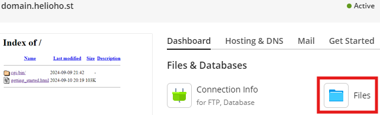
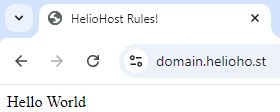
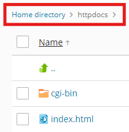

# Creating a Website

## Preface

This tutorial will walk you through setting up a basic website on HelioHost. The examples below show [Plesk](../../features/plesk.md)'s built-in File Manager, but you can accomplish the same result by [managing files using FTP](../../management/uploading-files.md) if you prefer. 

## Log in to Plesk

Follow the navigation steps below to access the File Manager inside Plesk: 

#### Login > Plesk > Websites & Domains > [ domain ] > Files




Do not bookmark your Plesk File Manager, as your visits are not recorded and you will be [suspended for inactivity](../../accounts/suspension-policy.md#inactivity-policy) after 30 days.


## Navigate into Webroot Directory

For your main (or only) Heliohost domain or subdomain, your webpage files will be located at:  
`Home directory > httpdocs`

For an add-on domain or subdomain, your webpage files will be located at:  
`Home directory > domain.helioho.st`

## Delete the Default Plesk Page

The file named `index.html` is the default page that Plesk adds to new domains or subdomains. It can be replaced with a new `index.html` file that contains your own code.

Select the `index.html` file and delete it by clicking on the `Remove` button.

Select the `Skip the Recycle Bin and permanently remove index.html` option. Files in your Recycle Bin count towards your [account storage limits](../../accounts/suspension-policy.md#account-storage-limits), and you will never need the default index page file again.

## Create a new Index Page

Click on the `+` button and select `Create File` from the options menu.

Select the `Use the HTML template` since this will pre-populate some helpful HTML code into the blank file for you.

## Confirm Location of New File

For your main (or only) Heliohost domain or subdomain, the `index.html` file should be created inside: `Home directory > httpdocs`. In the `Create a File` window, you should see `Add a file to: /httpdocs`, as shown below:


For an add-on domain or subdomain, the `index.html` file should be created inside: `Home directory > domain.helioho.st`. In the `Create a File` window, you should see `Add a file to: /domain.helioho.st`, as shown below:


## Edit the new Index Page

Use the right-side menu to choose how to open the new `index.html` page you just made:
* the `Code Editor` offers basic content editing.
* the `Text Editor` offers basic content editing, various encoding options and different line break type options.
* the `HTML Editor` offers a straightforward `WYSIWYG` (short for `What You See Is What You Get`) file editor, allowing you to change and preview styling options (change the page background color, insert images or links, use bold text, change font color or size, etc.).


For this tutorial, we will use the `Code Editor` option to publish a very basic webpage.

Click on the filename to open the file in the Code Editor. You should see the simple `HTML template` content we chose when we created the new file:


Edit the contents of the file to the below:
```text
<html>
  <head>
    <title>HelioHost Rules!</title>
  </head>
  <body>
Hello World
  </body>
</html>
```

Click on the `Save` button. 

Either select the file and choose the `Open in Browser` option, or open a new browser window and navigate to `domain.helioho.st`

If everything worked, you should see the below page displayed in your browser: 



## Troubleshooting

### Still Seeing the Plesk Default Page


All domain and subdomain changes take **up to 2 hours** to go into effect as they require an Apache restart.


If you have a HelioHost account that is less than 2 hours old, or have asked the admins to add the new domain or subdomain you're trying to use less than 2 hours ago, you may not see the file edits take effect yet. If it's been longer than **a full 2 hours**, please make sure to [clear your web browser cache](../../misc/clear-your-cache.md). 

### Seeing a List of Files

If you see a list of files instead of the `index.html` file you made, make sure you created the file in the correct location. 

On a main (or only) Heliohost domain or subdomain, the `index.html` file should be located inside: `Home directory > httpdocs` as shown below:



On an add-on domain or subdomain, the `index.html` file should be located inside: `Home directory > domain.helioho.st` as shown below:


If there is no `index.html` page inside the webroot folder, a list of the files it contains will be shown instead. This is called `directory indexing` or `directory listing`. 

### Directory Indexes

Directory indexes are enabled on our servers because many users have requested this feature. If you prefer to prevent directory listings for any folder, simply place an empty `index.html` file inside it. This will display a blank page instead of a list of files when someone visits the directory’s web address.

## Further Support

If you get stuck after following the instructions above, please go back and check all of your steps again. If you can't figure out what is wrong, please post a topic in the [Customer Support forum](https://helionet.org/index/forum/45-customer-service/?do=add). Please make sure you provide your **username**, your **domain website address**, and **error message(s)** encountered.