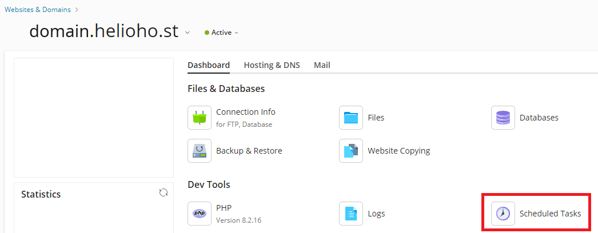

# Cron Jobs

In Plesk, cron jobs are called `Scheduled Tasks`. 

## Setting Up a Cron Job

To access the cronjob section, navigate to:

### Login > Plesk > Websites & Domains > [ domain ] > Scheduled Tasks > `Add Task`


Scheduled tasks run in a chroot environment with limited access to binaries and executables.  

This means you cannot directly access certain programs or scripts outside of your home directory.


To work around the chroot, you can create a Flask or Python CGI endpoint like `domain.helioho.st/update` and then use the "Fetch a URL" option inside Scheduled Tasks to access it via `https`.