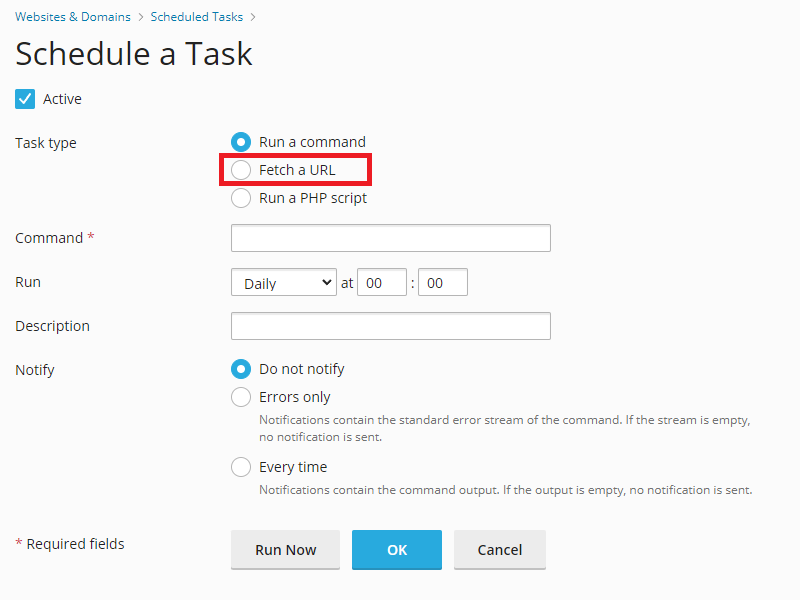

# Cron Jobs

<!-- Note: Variations of the term 'cron job', including 'cronjob', 'cron jobs', and 'cronjobs' have been used in this document to enhance discoverability in Wiki search queries.  -->

## Cron Jobs / Scheduled Tasks

In Plesk, cron jobs are called `Scheduled Tasks`. 

## Cron Jobs Affect Account Load


Scheduled Tasks count towards your total account load. This means that running too many cronjobs or starting a cronjob to run every 1 minute risks your account getting suspended for [high server usage](../../accounts/suspension-policy.md#high-server-usage). Refer to the [Cron Jobs section of our Suspension Policy](../../accounts/suspension-policy.md#cron-jobs) for more details.


## Setting up a Scheduled Task

To access the cron job section, navigate to:  

**Login > Plesk > Websites & Domains > [ domain ] > Scheduled Tasks > `Add Task`**

## Cron Jobs are chrooted


Scheduled Tasks run in a chroot environment with limited access to binaries and executables for security reasons.
This means you cannot directly access certain programs or scripts outside of your home directory.


## Working Around the chroot

Some options to work around the chroot environment when setting up a Scheduled Task include:  

### Flask Endpoint

Set up a Flask application and create an endpoint like `domain.helioho.st/update`, then use the "Fetch a URL" option inside Scheduled Tasks to access it via `https`.

If you're new to Flask or want a more detailed guide, check out this [Flask tutorial](../flask.md) to help you get started.

### Python

Set up a Python script in the `cgi-bin` directory, then use the "Fetch a URL" option inside Scheduled Tasks to access the file via `https`.

If you're new to Python or want a more detailed guide, check out this [Python tutorial](../python.md) to help you get started.

