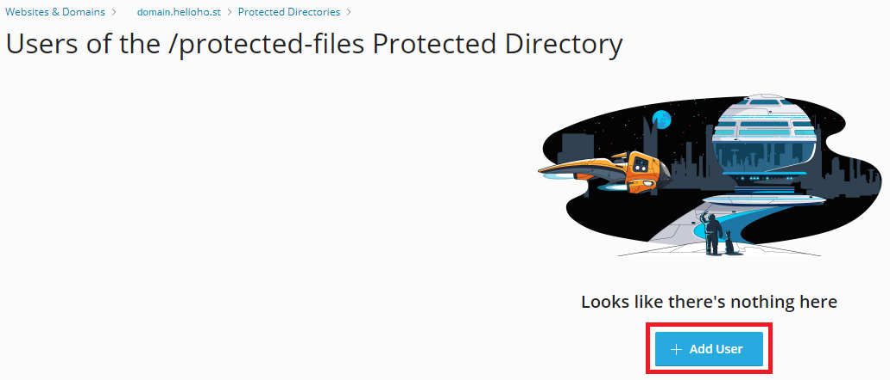
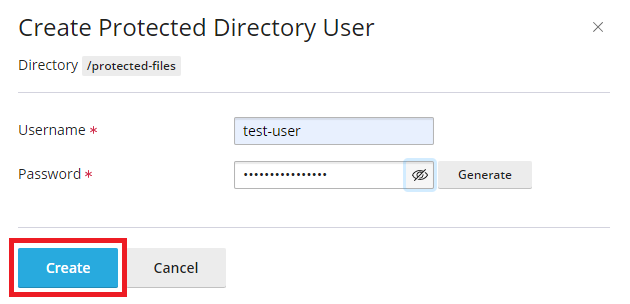
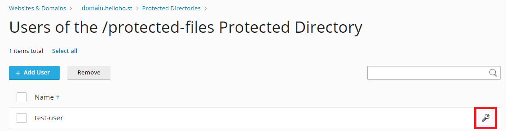
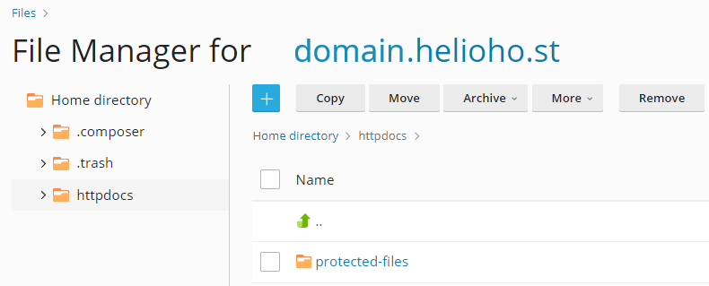
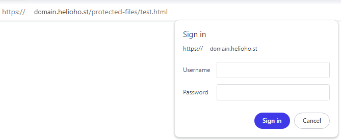
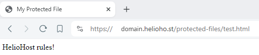

# Password Protect a Directory in Plesk


Password protection can take **up to 2 hours** to go into effect as it requires an Apache restart.

We recommend you ensure that password protection is in place before uploading any sensitive files.


## Login to Plesk

Navigate to: 

**Login > Plesk > Websites & Domains > [ domain ] > `Password-Protected-Directories`**

## Add Protected Directory


Click the `Add Protected Directory` button and enter the details below:  

* In the `Directory name` field, enter the path, relative to your domain root directory, to the directory you want to protect
  * Your domain root directory is `httpdocs` or if you were transferred from the old cPanel it will be called `public_html`
  * The specified directory will be created if it does not already exist
* Optionally, add a directory title in the `Title of the protected area` field
* Click the `Create` button


You should see a confirmation message of: `Protected directory / [directory] was successfully created`


The directory will appear in the list of your domain's protected directories.

## Add User Permissions

To access the protected directory, it must have at least one user associated with it. To add a user, click on the directory name:


Click on the `Add User` button.



Enter a Username and Password for the new user, and click on the `Create` button. 



You should see a confirmation message of: `The protected directory user [username] was created`.


The user will appear in the list of the protected directory's users. 

To add more users, click the `Add User` button and repeat the above steps. To change the password of an existing user, click on the key image.



## Add File(s) to Protected Directory

Since directory listing is not enabled, there must be at least one file inside the password protected directory, or else a `403 Forbidden` error will result.

Using Plesk's File Manager or your preferred method of [uploading files](../../management/uploading-files.md), navigate to `httpdocs/protected-files` (or `public_html/protected-files` if you were transferred from the old cPanel), and add your file(s).



For testing purposes, you could create a file called `test.html` file and paste in the content below:

```html
<!doctype html>
<html lang="en">
<head>
    <meta charset="utf-8">
    <title>My Protected File</title>
</head>
<body>
    HelioHost rules!
</body>
</html>
```

## Wait for Apache Restart


Password protection can take **up to 2 hours** to go into effect as it requires an Apache restart.


## Web Browser Access

Within **up to 2 hours** of password protection being activated on your directory, navigate to `domain.helioho.st/protected-files/test.html` in your web browser.



## Enter Username and Password

Enter the Username and Password you created, once you are signed in successfully, you should see a message of `HelioHost rules!`



## Additional Guidance

This [Plesk article](https://docs.plesk.com/en-US/obsidian/customer-guide/websites-and-domains/restricting-access-to-content.65152/) contains extra details and a walkthrough video.