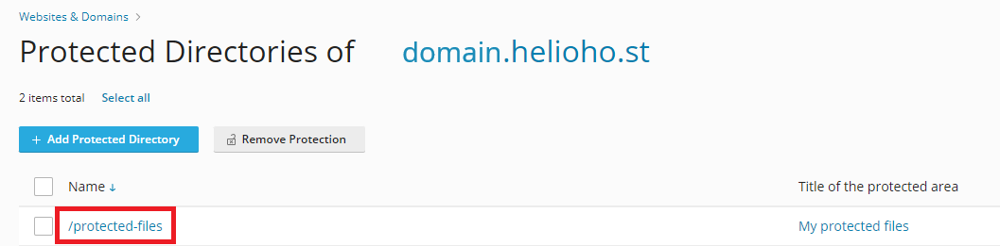

# Password Protect a Directory in Plesk


Password protection can take **up to 2 hours** to go into effect as it requires an Apache restart.


## Login to Plesk

Navigate to: 

**Login > Plesk > Websites & Domains > [ domain ] > `Password-Protected-Directories`**

## Add Protected Directory

Click the `Add Protected Directory` button and enter the details below:  

* In the `Directory name` field, enter the path, relative to your domain root directory, to the directory you want to protect
  * Your domain root directory is `httpdocs` or if you were transferred from the old cPanel it will be called `public_html`
  * The specified directory will be created if it does not already exist
* Optionally, add a directory title in the `Title of the protected area` field
* Click the `Create` button

You should see a confirmation message of: `Protected directory / [directory] was successfully created`

The directory will appear in the list of your domain's protected directories.

## Add User Permissions

To access the protected directory, it must have at least one user associated with it. To add a user, click on the directory name:

Click on the `Add User` button, enter a Username and Password for the new user, and click on the `Create` button. 

You should see a confirmation message of: `The protected directory user [username] was created`.

