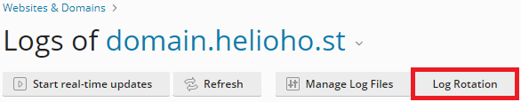
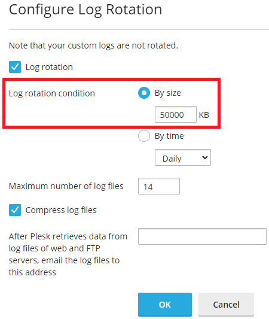

# Viewing Error Logs

## Where to find hosting account error logs

Follow the navigation steps below to view your hosting account error logs inside Plesk:  

### Login > Plesk > Websites & Domains > [ domain ] > Logs

## Limiting the Storage Space Used by Error Logs

Error logs are counted as part of your total account storage. To help prevent [account suspension for exceeding your disk quota](../../accounts/suspension-policy.md#account-storage-limits), we recommend limiting the size of your error log files using Plesk's built-in Log Rotation feature.

Follow the navigation steps below to update the Log Rotation settings in Plesk:  

### Login > Plesk > Websites & Domains > [ domain ] > Logs > click on the Log Rotation button

We recommend setting the maximum log size to something reasonable like 50 MB or so.

### Further Support

If after following the above steps, you are unable to view your account error logs, or if you require further assistance, please post a topic in the [Customer Support forum](https://helionet.org/index/forum/45-customer-service/?do=add) and make sure you provide **your hosting account username** and details of the problem, including any **error message(s)** received.