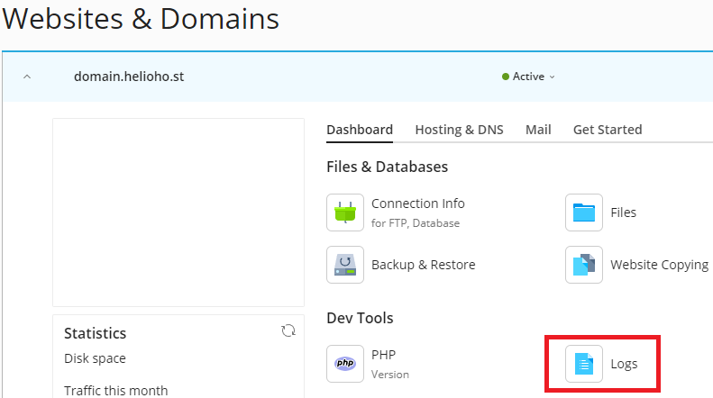

# Viewing Error Logs

## Where to find hosting account error logs

Follow the navigation steps below to view your hosting account error logs inside Plesk:  

### Login > Plesk > Websites & Domains > [ domain ] > Logs

#### Screenshot:

### Further Support

If after following the above steps, you are unable to view your account error logs, or if you require further assistance, please post a topic in the [Customer Support forum](https://helionet.org/index/forum/45-customer-service/?do=add) and make sure you provide **your hosting account username** and details of the problem.