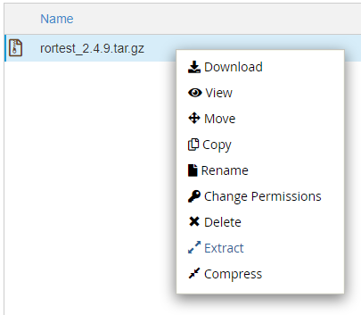
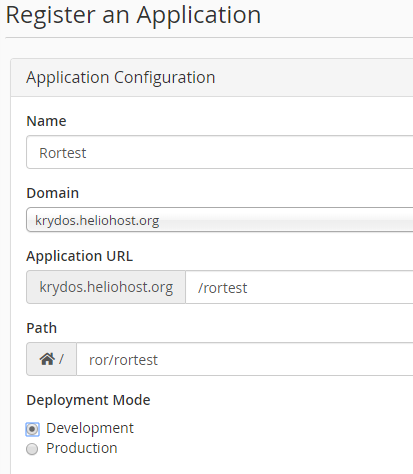

# Ruby on Rails


Ruby on Rails is available on Tommy, Johnny, or the VPS plans.


## Preface

HelioHost is one of the few free web hosts to offer the Ruby programming language. A combination of Perl's syntax and Smalltalk's semantics, Ruby is a recent language that is growing in popularity. Ruby's compatibility with multiple programming paradigms allows it great versatility and makes it an easy language to learn for existing developers. One of HelioHost's unique offerings is the ability of each user to configure their own Ruby extensions \(known as Ruby Gems\) from their control panel.

We also offer the powerful Ruby on Rails web application framework. This framework contains all the essentials for building a web application, and greatly simplifies the task by providing libraries tailored to do almost any task. By utilizing the Model-View-Controller architectural pattern, Rails effectively separates different aspects of your web application, allowing for modular design and extensibility.

## How to set up Ruby on Rails

Create a new directory in your home folder named `ror`. Make sure this `ror` directory is NOT in your `public_html` folder.

```text
/home/username/ror
```

Download the Ruby on Rails files from [https://krydos.heliohost.org/ror/rortest\_2.4.10.tar.gz](https://krydos.heliohost.org/ror/rortest_2.4.10.tar.gz)

Upload the rortest archive to the ror directory that you just created.

```text
/home/username/ror/rortest_2.4.10.tar.gz
```

Use file manager to extract the archive by right clicking on the file and selecting extract.



Now we need to register the Ruby on Rails application in cPanel so open the [Application Manager](https://tommy.heliohost.org:2083/frontend/paper_lantern/passenger/index.html).


Click "+ Register Application".


For name enter `Rortest`, domain select your main domain, application url put `/rortest`, path enter `ror/rortest`, and deployment mode select `Development`so it looks something like this:



Then click deploy. In order for the Rails application to be deployed it requires an apache restart so this could take anywhere from a few minutes to a few hours. If it's been more than 2 hours and it still isn't working please open [a customer service ticket](https://www.helionet.org/index/forum/45-customer-service/) and let us know.

Once the Ruby on Rails application has been deployed you should be able to go to domain.heliohost.org/rortest and see the it in action. This is just the beginning though. From here you should edit your default files to create the Ruby on Rails website you've always wanted. Let us know if you need help.

