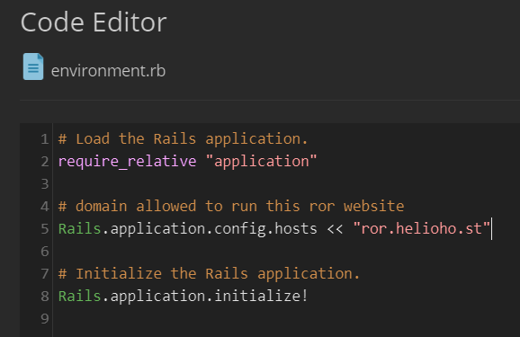

# Ruby on Rails


Ruby on Rails is available on [Tommy](servers/virtual/tommy.md), [Johnny](servers/virtual/johnny.md), or the [VPS plans](https://heliohost.org/vps/).


## Preface

HelioHost is one of the few free web hosts to offer the Ruby programming language. A combination of Perl's syntax and Smalltalk's semantics, Ruby is a mature production language that remains popular. Ruby's compatibility with multiple programming paradigms allows it great versatility and makes it an easy language to learn for existing developers.

We also offer the powerful Ruby on Rails web application framework. This framework contains all the essentials for building a web application, and greatly simplifies the task by providing libraries tailored to do almost any task. By utilizing the Model-View-Controller architectural pattern, Rails effectively separates different aspects of your web application, allowing for modular design and extensibility.

## How to set up Ruby on Rails

### Download the example project

Download the example Ruby on Rails files from: [https://krydos.heliohost.org/ror_ruby3.2.1_rails7.0.5.zip](https://krydos.heliohost.org/ror_ruby3.2.1_rails7.0.5.zip)

### Delete the default index page

[Login](https://heliohost.org/login/) to your HelioHost account, and continue to Plesk. Click `Files` in the main left menu. Navigate to `httpdocs`. Click the checkbox to the left of the `index.html` file and then click the `Remove` button to delete the default Plesk page. We recommend that you choose the `Skip the Recycle Bin` option and click the `Yes, remove` button. 

### Upload the example project

Now navigate up one level to your home directory and click the `+` button to upload the zip file. Locate the `ror_ruby3.2.1_rails7.0.5.zip` file that you just downloaded, and upload it to Plesk.

### Extract the example project files

Now click the filename of `ror_ruby3.2.1_rails7.0.5.zip` to extract the zip file. Make sure that it is extracting the files to the `/` directory and not to `httpdocs` or anywhere else.

### Edit the `environment` file

Click on the `config` directory, and then click the `environment.rb` file to edit it. You'll need to change the line that says `yourdomain.helioho.st` to your actual domain. Then save the file.

### Install Ruby

Now click `Websites and Domains` on the main left Plesk menu. If you're on the old `Active List view` you can just click the `Ruby` button, but if you're on the `Dynamic List view` you'll need to click `Create Website (CMS, Builders, and more)` and then click `Ruby` from the menu displayed. 

### Enable Ruby

The test Ruby on Rails files are designed for Ruby 3.2.1 so ensure you have `Ruby Version` set to `3.2.1-p31`. Change the `Application Mode` from `production` to `development` so you can see errors later, and wait until you see a confirmation message that says `Information: Application mode was successfully updated`. Then click `Enable Ruby` and wait for the confirmation message saying Ruby was enabled:

### Wait for Ruby Deployment


In order for the Rails application to be deployed it requires an Apache restart. Apache restarts happen every 2 hours. Please be patient and wait for the full 2 hours before assuming anything is broken.


If everything is working it should look like this: 

Once you've got this basic example working we encourage you to edit the files, and create your Ruby on Rails website. Let us know if you have any questions.

### Further Support 

If it doesn't work, go back and check all of your steps again. If it's been more than a full 2 hours and it still isn't working please make a new post in the [Customer Service forum](https://helionet.org/index/forum/45-customer-service/?do=add), making sure to provide your **username** and any **error messages** you are encountering.