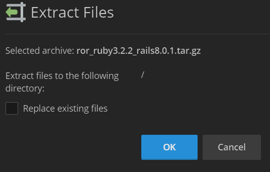
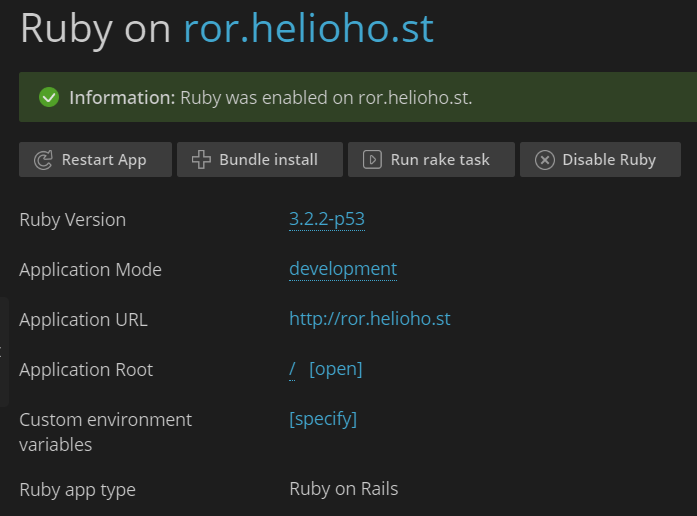

# Ruby on Rails


Ruby on Rails is available on Tommy, Johnny, or the VPS plans.


## Preface

HelioHost is one of the few free web hosts to offer the Ruby programming language. A combination of Perl's syntax and Smalltalk's semantics, Ruby is a recent language that is growing in popularity. Ruby's compatibility with multiple programming paradigms allows it great versatility and makes it an easy language to learn for existing developers. One of HelioHost's unique offerings is the ability of each user to configure their own Ruby extensions \(known as Ruby Gems\) from their control panel.

We also offer the powerful Ruby on Rails web application framework. This framework contains all the essentials for building a web application, and greatly simplifies the task by providing libraries tailored to do almost any task. By utilizing the Model-View-Controller architectural pattern, Rails effectively separates different aspects of your web application, allowing for modular design and extensibility.

## How to set up Ruby on Rails

Download the example Ruby on Rails files from [https://krydos.heliohost.org/ror_ruby3.2.1_rails7.0.5.zip](https://krydos.heliohost.org/ror_ruby3.2.1_rails7.0.5.zip)

[Login](https://heliohost.org/login/) to your HelioHost account, and continue to Plesk. Click files in the main left menu. Navigate to httpdocs. Click the checkbox to the left of the index.html file and then click remove to delete the default Plesk page.

Now navigate up one level to your home directory and click the + button to upload the zip file. Locate the ror_ruby3.2.1_rails7.0.5.zip file that you just downloaded, and upload it to Plesk.

Now click the filename of ror_ruby3.2.1_rails7.0.5.zip to extract the zip file. Make sure that it is extracting the files to the directory / not httpdocs or anywhere else.

Click on the config directory, and then click the file environment.rb to edit it. You'll need to change the line that says yourdomain.helioho.st to your actual domain. Then save the file.

Now click Websites and Domains on the main left Plesk menu. If you're on the active view you can just click the Ruby button, but if you're on the dynamic view you'll need to click install application first, and then click Ruby.

The test Ruby on Rails files are desgined for Ruby 3.2.1 so you shouldn't need to change the Ruby version. Change the mode from production to development so you can see errors later, and then click Enable Ruby.

In order for the Rails application to be deployed it requires an Apache restart so this could take anywhere from a few minutes to a few hours. If it's been more than 2 hours and it still isn't working please open [a customer service ticket](https://helionet.org/index/forum/45-customer-service/?do=add) and let us know. If everything is working it should look like this.

Once you've got this basic example working we encourage you to edit the files, and created your Ruby on Rails website. Let us know if you have any questions.
