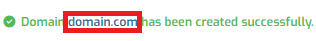

# Setting Up Email on a VPS running Hestia Control Panel

This tutorial will help you set up SMTP email service using the Hestia Control Panel installed on your HelioHost VPS.

## Getting Started

You will need: 
* A [HelioHost VPS](https://heliohost.org/vps/)
* Hestia Control Panel installed on your VPS
  * Your VPS will come with Hestia preinstalled if you requested this during signup
  * Alternatively, you can install Hestia yourself. There is a helpful tutorial [here](https://hestiacp.com/docs/introduction/getting-started.html).
* A domain you want to use for email

## Log In to Hestia

In your web browser, navigate to `vps##.heliohost.us` and log in to your Hestia Control Panel.

## Check Firewall Rules

First, we will make sure the necessary ports are open:
* Click on the Settings gear wheel icon at the top right
* Click on the `Firewall` button

## Confirm Open Ports

Doublecheck that the following Ports are set to `Accept` connections from IP Address `0.0.0.0/0` (which means it allows all IP ranges):
* Hestia: 8083
* SMTP: 25, 465, 587
* Web: 80, 443


If you already have a domain set up inside Hestia that you want to add mail service to, you can skip right to the [Add Mail Domain](#add-mail-domain) section.


## Create a Standard User Account

The system administrator account we used to log in to Hestia has increased privileges. To prevent potential security risks, we will create an account with fewer permissions that will still enable us to set mail service up.

* Click on the `User` tab
* Click on the `Add User` button
* Fill in the form fields
* Set the `Role` field to `User`
* Set the `Package` to `Default`
* Click on the `Save` button at the top right side of the page
* You should see a message that says: "User `username` has been created successfully. / Log in as `username`"
* Click on the link that says: "Log in as `username`"

### Add Web Domain

* Click on the `Web` tab
* Click on the `Add Web Domain` button
* Enter your domain or subdomain
* Select the `Mail Support` option to enable email for this domain
* Click on the `Save` button at the top right side of the page
* You should see a message that says: "Domain `domain.com` has been created successfully."

## Add Mail Domain

Click on the `Mail` tab 

If your domain is not listed:
* Click on the `Add Mail Domain` button
* Set the `Domain` field to `domain.com`
* Optional: set `Webmail Client` to `Disabled` if you do not want webmail functionality
* Select `DKIM Support`
* Click on the `Save` button at the top right side of the page
* You should see a message that says "Mail domain `domain.com` has been created successfully."
* Click on the `Mail` tab again
* Click on the small `DNS Records` button next to your domain

If your domain is listed: 
* Click on the small `DNS Records` button next to your domain

## View DNS Records

Hestia Control Panel automatically creates the necessary mail records for our SMTP server. To view your mail DNS records, select the `Mail` tab and click on the small `DNS Records` button next to your domain. 

You will need to login to your domain registrar account and add all the records to the DNS management section.

## Add Mail User Accounts

After adding all the DNS records to your domain registrar site, return to Hestia. Ensure you are logged in as the user who set up the mail domain. 
* Click on the `Mail` tab
* Click on the small `Add Mail Account` button next to your domain

## Add Email Account
* Enter the `Account` name and `Password` for the email account
  * The value you enter for `Account` will be the first part (before the `@domain`) of the email address
* Click on the `Save` button
* You should see a message that says: "Mail account `name@domain.com` has been created successfully."