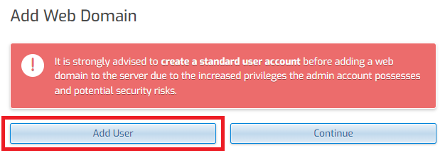
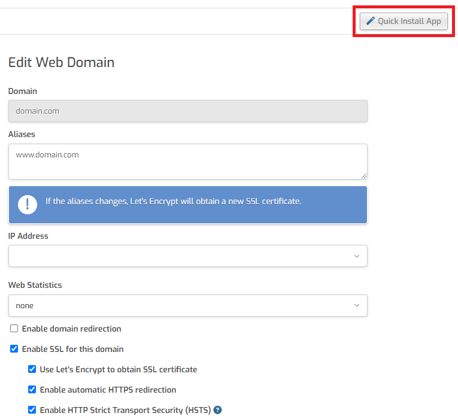

# Installing WordPress on a VPS running Hestia Control Panel

This tutorial will help you set up a WordPress site using the Hestia Control Panel installed on your HelioHost VPS.

## Prerequisites

Before you start, you will need:
* A HelioHost VPS
* Hestia Control Panel installed on your VPS
  * Hestia can be installed as part of your VPS order, or you can install it later yourself.
* A domain or subdomain registered for your WordPress site

The below steps demonstrate how to set WordPress up directly on a domain, such as `domain.com`. It is also possible to install WordPress on a subdomain (`blog.domain.com`) or within a directory (`domain.com/blog`) if you prefer.

## Create a Standard User Account

In your web browser, navigate to `vps##.heliohost.us` and log in to your Hestia Control Panel.
* Select the `Web` tab
* Then click on the `Add Web Domain` button

You will probably see a warning message that says "It is strongly advised to create a standard user account before adding a web domain to the server due to the increased privileges the admin account possesses and potential security risks."

We will follow this advice in the warning message and create a standard user account: 
* Click the `Add User` button
* Fill in the form fields
* Set the `Role` field to `User`
* Set the `Package` to `Default`
* Click the `Save` button at the top right side of the page
* You should see a message that says "User `username` has been created successfully. / Log in as `username`"
* Click on the link that says "Log in as `username`"

## Add Web Domain

* Select the `Web` tab
* Click on the `Add Web Domain` button
* Enter your domain or subdomain
* Click the `Save` button at the top right side of the page
* You should see a message that says "Domain `domain.com` has been created successfully."
* Click on the link to go to `domain.com`

### Enable SSL

* We recommend that you enable SSL for your domain
* Select your preferred SSL settings, and click the `Save` button at the top right side of the page
* You can optionally activate `Web Statistics` (or you can return to this page later to edit this)
  * If activating web stats, we recommend enabling `Statistics Authorization` so your stats remain login-protected
* You should see a message that says `Changes have been saved.`

## Install WordPress

* Click the `Quick Install App` button at the top right side of the page
* Find WordPress from the list of available apps and click the `Setup` button

## Create WordPress Site

* Enter the details for your WordPress site
  * Site Name
  * WordPress Account Username
  * WordPress Account Email
  * WordPress Account Password
  * You can optionally specify an `Install Directory` for your WordPress installation (such as `/blog`)
* Click the `Save` button at the top right side of the page
* You should see a message that says `WordPress installed successfully.`

## Visit Your WordPress Site

* Click on the `Web` tab
* Click on your domain, or select the small `Visit` button
* You should see a fresh WordPress site

## Login to WordPress as Admin

* In your web browser, navigate to `domain.com/wp-admin` 
* Enter your WordPress user credentials
* You should see your WordPress Admin Dashboard

### Further Support

If after following the above steps, you are unable to view your WordPress page, or if you require further assistance, please post a topic in the [Customer Support forum](https://helionet.org/index/forum/45-customer-service/?do=add). Please make sure you provide your **VPS number** and details about the problem, including any **error message(s)** received.