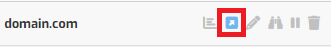

# Installing WordPress on a VPS running Hestia Control Panel

This tutorial will help you set up a WordPress site using the Hestia Control Panel installed on your [HelioHost VPS](https://heliohost.org/vps/).

## Getting Started

You will need: 
* A [HelioHost VPS](https://heliohost.org/vps/)
* Hestia Control Panel installed on your VPS
  * Your VPS will come with Hestia preinstalled if you requested this during signup
  * Alternatively, you can install Hestia yourself. There is a helpful tutorial [here](https://hestiacp.com/docs/introduction/getting-started.html).
* A domain or subdomain registered for your WordPress site
  * You can use your own domain or subdomain, or the one free subdomain offered with a VPS plan

The below steps demonstrate how to set WordPress up directly on a domain, such as `domain.com`. It is also possible to install WordPress on a subdomain (`blog.domain.com`) or within a directory (`domain.com/blog`) by making small adjustments to the steps below.


If you already have a domain set up inside Hestia that you want to install WordPress on, you can skip right to the [Install WordPress](#install-wordpress) section.


## Create a Standard User Account

The system administrator account we used to log in to Hestia has increased privileges. To prevent potential security risks, we will create an account with fewer permissions that will still enable us to install WordPress.

In your web browser, navigate to `vps##.heliohost.us` and log in to your Hestia Control Panel. Once logged in, follow the steps below: 
* Click on the `User` tab
* Click on the `Add User` button
* Fill in the form fields
* Set the `Role` field to `User`
* Set the `Package` to `Default`
* Click on the `Save` button at the top right side of the page
* You should see a message that says: "User `username` has been created successfully. / Log in as `username`"
* Click on the link that says: "Log in as `username`"

## Add Web Domain

* Click on the `Web` tab
* Click on the `Add Web Domain` button
* Enter your domain or subdomain
* Click on the `Save` button at the top right side of the page
* You should see a message that says: "Domain `domain.com` has been created successfully."
* Click on the `domain.com` link to go to the `Edit Web Domain` settings page

## Enable SSL

* We recommend that you enable SSL for your domain
* Select your preferred SSL settings, and click on the `Save` button at the top right side of the page
* You can optionally activate `Web Statistics` (or you can return to this page later to activate stats)
  * If activating web stats, you can optionally enable `Statistics Authorization` to keep your statistics login-protected
* You should see a message that says `Changes have been saved.`

## Install WordPress

* Click on the `Web` tab
* Click on the small `Edit Domain` button next to your domain

* Click on the `Quick Install App` button at the top right side of the page
* Find WordPress in the list of available apps and click on the `Setup` button

## Create WordPress Site

* Enter the details for your WordPress site:
  * Site Name
  * WordPress Account Username
  * WordPress Account Email
  * WordPress Account Password
  * You can optionally specify an `Install Directory` for your WordPress installation (such as `/blog`)
* Click on the `Save` button at the top right side of the page
* You should see a message that says `WordPress installed successfully.`

## Visit Your WordPress Site

* Click on the `Web` tab
* Click on the small `Visit` button next to your domain
* You should see a fresh WordPress site

## WordPress Admin Login

* In your web browser, navigate to `domain.com/wp-admin` 
* Log in using your WordPress user credentials
* You should see your WordPress Admin Dashboard

## Further Support

If after following the above steps, you are unable to view your WordPress page, or if you require further assistance, please post a topic in the [Customer Support forum](https://helionet.org/index/forum/45-customer-service/?do=add). Please make sure you provide your **VPS number** and details about the problem, including any **error message(s)** received.